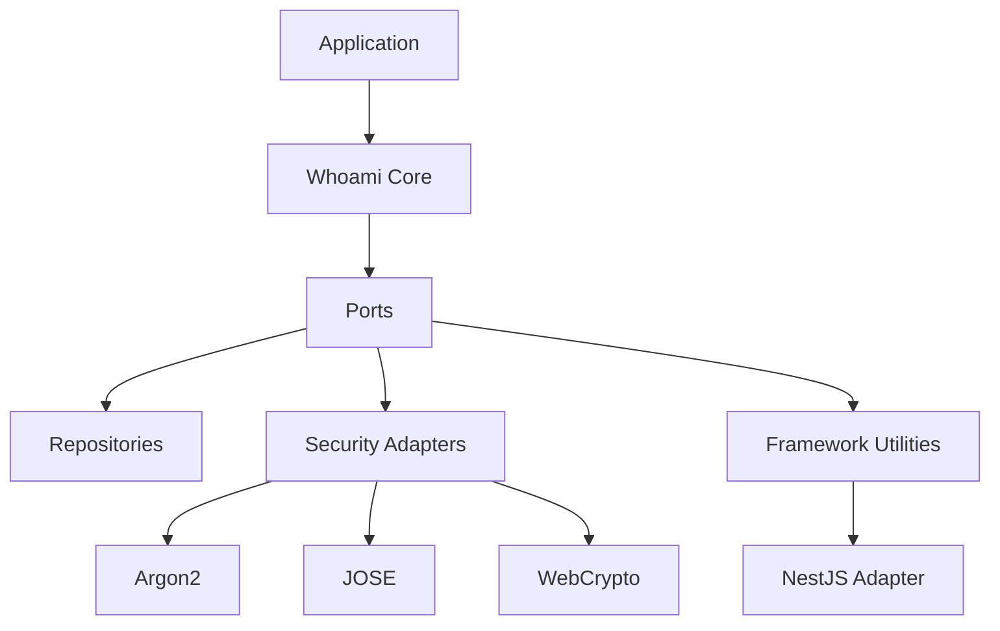

# whoami

Identity-first authentication for TypeScript applications.

## Why Teams Pick It

- Keep authentication rules in a framework-agnostic core.
- Compose only the adapters you need for hashing, JWTs, and framework integration.
- Preserve strong typing across user IDs, including `string` and `number` identifiers.

## Architecture At A Glance



## Quick Links

| Area | Purpose |
| --- | --- |
| [packages/](packages/README.md) | Package map for the monorepo |
| [packages/core/](packages/core/README.md) | Core authentication engine |
| [docs/architecture.md](docs/architecture.md) | Architecture overview |
| [docs/type-model.md](docs/type-model.md) | ID and token typing rules |

## Package Map

- `@odysseon/whoami-core`: feature-first domain and application building blocks.
- `@odysseon/whoami-adapter-argon2`: password hashing adapter.
- `@odysseon/whoami-adapter-jose`: receipt signing and verification adapter.
- `@odysseon/whoami-adapter-webcrypto`: deterministic string hashing adapter.
- `@odysseon/whoami-adapter-nestjs`: NestJS receipt-auth module, guard, decorator, and exception filter.

## Quick Start

```bash
pnpm install
pnpm test
```

Feature-first example:

```ts
import {
  IssueReceiptUseCase,
  RegisterAccountUseCase,
  VerifyPasswordUseCase,
} from "@odysseon/whoami-core";
```

## Development

```bash
pnpm -r exec tsc --noEmit
pnpm test
```

## License

[ISC](LICENSE)
