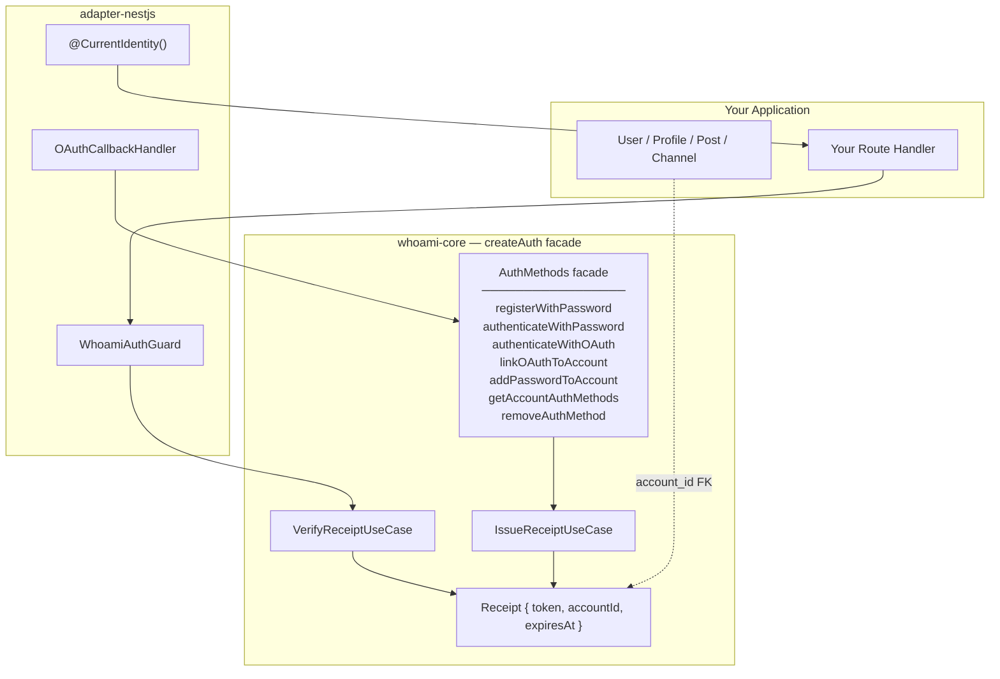

# whoami

**whoami answers one question: who is making this request?**

It handles identity — registration, authentication (password and OAuth), and signed receipt tokens. It does not manage profiles, roles, or application-level user data. That is intentionally your domain.

## Why this matters

Most auth libraries conflate identity with user management. They force you to extend their `User` model, fight their schema, and work around their assumptions. whoami owns exactly one thing:

```
AccountId ──► "This request is from account abc-123. You can trust that."
```

Everything else — what that account can do, what profile they have, what community they belong to — lives in your application, linked by a single foreign key.

## Core value

- **Framework-agnostic core.** Domain logic has zero framework or I/O dependencies. Bring your own NestJS, Express, Fastify, or none.
- **Adapter-based extensibility.** Swap hashing algorithms, JWT strategies, or frameworks by swapping one package.
- **Typed identity primitive.** `AccountId` accepts `string | number` — no forced UUID, no silent cast.

## How your entities link to Account

whoami returns an `AccountId` after authentication. Your application creates its own user record linked by that ID. No base class to extend, no schema to fight.

```
whoami DB:
  accounts  { id, email }                      ← all whoami ever stores

your DB:
  users     { id, account_id ← accountId.value, display_name, avatar, ... }
  posts     { id, author_id  → users.id }
  channels  { id, owner_id   → users.id }
```

See [the example apps](#examples) for how this wiring looks in practice.

## Architecture at a glance



## Packages

| Package | Purpose |
|---|---|
| [`@odysseon/whoami-core`](packages/core/README.md) | Domain entities, use cases, port interfaces, and the `createAuth` factory facade |
| [`@odysseon/whoami-adapter-argon2`](packages/adapter-argon2/README.md) | `PasswordManager` implementation via argon2 |
| [`@odysseon/whoami-adapter-jose`](packages/adapter-jose/README.md) | `ReceiptSigner` / `ReceiptVerifier` via jose (HS256 JWT) |
| [`@odysseon/whoami-adapter-webcrypto`](packages/adapter-webcrypto/README.md) | `TokenHasher` via native Web Crypto API (API keys, opaque tokens) |
| [`@odysseon/whoami-adapter-nestjs`](packages/adapter-nestjs/README.md) | NestJS module, OAuth handler, guard, decorator, exception filter |

## Examples

| Example | Framework | What it shows |
|---|---|---|
| [`example-nestjs`](packages/example-nestjs/README.md) | NestJS 11 | DI wiring, password + OAuth flows, global guard, Swagger UI |
| [`example-express`](packages/example-express/README.md) | Express 5 | Minimal wiring, password + OAuth flows, custom auth middleware |

## Quick start

```bash
pnpm install

# run the NestJS example
pnpm --filter @odysseon/whoami-example-nestjs dev

# run the Express example
pnpm --filter @odysseon/whoami-example-express dev

# run all tests
pnpm test
```

## Key docs

| Doc | Purpose |
|---|---|
| [docs/architecture.md](docs/architecture.md) | Zone model, dependency rules, feature structure |
| [docs/type-model.md](docs/type-model.md) | AccountId, Receipt, CredentialProof, AuthMethods, error types |

## Development

```bash
pnpm -r exec tsc --noEmit   # typecheck all packages
pnpm test                    # test all packages
```

## License

[ISC](LICENSE)
