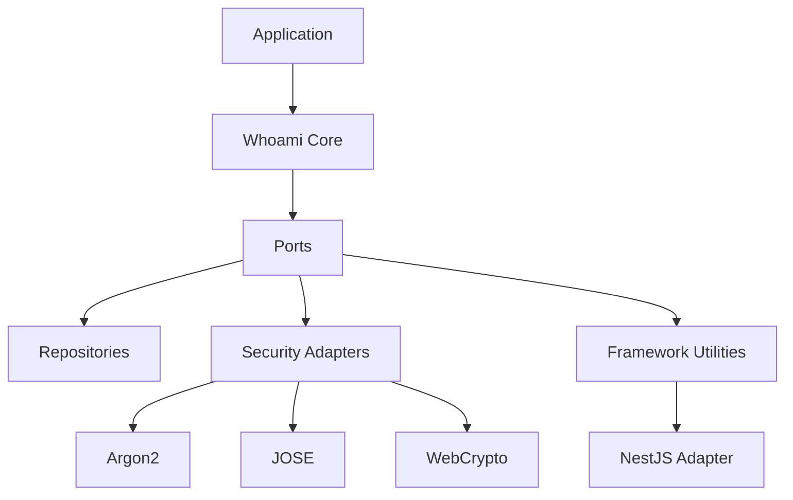

# whoami

Identity-first authentication for TypeScript applications.

## Why Teams Pick It

- Keep authentication rules in a framework-agnostic core.
- Compose only the adapters you need for hashing, JWTs, and framework integration.
- Preserve strong typing across user IDs, including `string` and `number` identifiers.

## Architecture At A Glance



## Quick Links

| Area | Purpose |
| --- | --- |
| [packages/](packages/README.md) | Package map for the monorepo |
| [packages/core/](packages/core/README.md) | Core authentication engine |
| [docs/architecture.md](docs/architecture.md) | Architecture overview |
| [docs/type-model.md](docs/type-model.md) | ID and token typing rules |

## Package Map

- `@odysseon/whoami-core`: the domain facade, contracts, and orchestration logic.
- `@odysseon/whoami-adapter-argon2`: password hashing adapter.
- `@odysseon/whoami-adapter-jose`: JWT signing and verification adapter.
- `@odysseon/whoami-adapter-webcrypto`: deterministic token hashing adapter.
- `@odysseon/whoami-adapter-nestjs`: NestJS module, controller, guard, and exception filter.

## Quick Start

```bash
pnpm install
pnpm test
```

```ts
import { WhoamiService, type UserWithEmail } from "@odysseon/whoami-core";
import { Argon2PasswordHasher } from "@odysseon/whoami-adapter-argon2";
import { JoseTokenSigner } from "@odysseon/whoami-adapter-jose";
import { WebCryptoTokenHasher } from "@odysseon/whoami-adapter-webcrypto";

type AppUser = {
  id: number;
  email: string;
};

const whoami = new WhoamiService<AppUser>({
  configuration: {
    authMethods: { credentials: true },
    refreshTokens: { enabled: true },
  },
  logger: console,
  tokenSigner: new JoseTokenSigner({
    secret: "replace-this-with-a-long-secret-of-at-least-32-characters",
  }),
  passwordHasher: new Argon2PasswordHasher(),
  tokenHasher: new WebCryptoTokenHasher(),
  tokenGenerator: {
    generate: () => crypto.randomUUID(),
  },
  passwordUserRepository: myPasswordRepository,
  refreshTokenRepository: myRefreshTokenRepository,
});

const user: UserWithEmail<AppUser> = await whoami.registerWithEmail({
  email: "user@example.com",
  password: "correct horse battery staple",
});
```

## Development

```bash
pnpm -r exec tsc --noEmit
pnpm test
```

## License

[ISC](LICENSE)
