# Architecture

whoami uses a strict zone model derived from Clean Architecture. Dependencies only point inward — Zone 3 depends on Zone 2, Zone 2 depends on Zone 1, Zone 1 depends on Zone 0. Zone 0 depends on nothing.

## Zone model

```mermaid
graph TD
    subgraph "Zone 3 — Infrastructure"
        Argon2["argon2 (npm)"]
        Jose["jose (npm)"]
        WebCrypto["node:crypto / globalThis.crypto"]
        NestJS["@nestjs/* (npm)"]
    end

    subgraph "Zone 2 — Adapters"
        ArgonAdapter["Argon2PasswordHasher"]
        JoseSigner["JoseReceiptSigner"]
        JoseVerifier["JoseReceiptVerifier"]
        WebCryptoAdapter["WebCryptoTokenHasher"]
        NestModule["WhoamiModule"]
        NestOAuthModule["WhoamiOAuthModule"]
        NestGuard["WhoamiAuthGuard"]
        NestFilter["WhoamiExceptionFilter"]
        OAuthHandler["OAuthCallbackHandler"]
    end

    subgraph "Zone 1 — Application"
        RegisterUC["RegisterAccountUseCase"]
        AuthOAuthUC["AuthenticateOAuthUseCase"]
        VerifyPwdUC["VerifyPasswordUseCase"]
        VerifyMagicUC["VerifyMagicLinkUseCase"]
        VerifyOAuthUC["VerifyOAuthUseCase"]
        IssueUC["IssueReceiptUseCase"]
        VerifyUC["VerifyReceiptUseCase"]
    end

    subgraph "Zone 0 — Domain"
        Account["Account entity"]
        Credential["Credential entity"]
        Receipt["Receipt entity"]
        AccountId["AccountId VO"]
        EmailAddress["EmailAddress VO"]
        CredentialId["CredentialId VO"]
        AccountRepo["AccountRepository port"]
        CredStore["CredentialStore port"]
        PasswordHasher["PasswordHasher port"]
        TokenHasher["TokenHasher port"]
        ReceiptSigner["ReceiptSigner port"]
        ReceiptVerifier["ReceiptVerifier port"]
        LoggerPort["LoggerPort"]
        Errors["Domain errors"]
    end

    Argon2 --> ArgonAdapter
    Jose --> JoseSigner
    Jose --> JoseVerifier
    WebCrypto --> WebCryptoAdapter
    NestJS --> NestModule
    NestJS --> NestGuard

    ArgonAdapter -.->|implements| PasswordHasher
    JoseSigner -.->|implements| ReceiptSigner
    JoseVerifier -.->|implements| ReceiptVerifier
    WebCryptoAdapter -.->|implements| TokenHasher

    NestGuard --> VerifyUC
    NestModule --> VerifyUC
    NestOAuthModule --> AuthOAuthUC
    NestOAuthModule --> IssueUC
    OAuthHandler --> AuthOAuthUC
    OAuthHandler --> IssueUC

    RegisterUC --> AccountRepo
    AuthOAuthUC --> AccountRepo
    AuthOAuthUC --> CredStore
    VerifyPwdUC --> CredStore
    VerifyPwdUC --> PasswordHasher
    VerifyMagicUC --> CredStore
    VerifyMagicUC --> TokenHasher
    VerifyOAuthUC --> CredStore
    IssueUC --> ReceiptSigner
    VerifyUC --> ReceiptVerifier

    RegisterUC --> Account
    AuthOAuthUC --> Account
    AuthOAuthUC --> Credential
    VerifyPwdUC --> Credential
    IssueUC --> Receipt
    VerifyUC --> Receipt
```



> Note: `OAuthCallbackHandler` is part of `@odysseon/whoami-core`; adapter packages wire it into Nest DI but do not own the implementation. `CredentialStore.deleteByEmail` should be implemented atomically to prevent magic-link replay.

## Zone rules

| Zone               | May depend on | May not depend on |
| ------------------ | ------------- | ----------------- |
| 0 — Domain         | Nothing       | Zones 1, 2, 3     |
| 1 — Application    | Zone 0        | Zones 2, 3        |
| 2 — Adapters       | Zones 0, 1    | Zone 3            |
| 3 — Infrastructure | Any           | —                 |

## Feature structure

The core is organised by feature, not by layer:

```
packages/core/src/
├── features/
│   ├── accounts/           Register and retrieve accounts
│   │   ├── application/    RegisterAccountUseCase
│   │   ├── domain/         Account entity, AccountRepository port
│   │   └── index.ts
│   ├── authentication/     Verify credentials (password, OAuth, magic link)
│   │   ├── application/    VerifyPasswordUseCase, VerifyMagicLinkUseCase,
│   │   │                   VerifyOAuthUseCase, AuthenticateOAuthUseCase
│   │   ├── domain/         Credential entity, CredentialStore port,
│   │   │                   PasswordHasher port, TokenHasher port, types
│   │   └── index.ts
│   └── receipts/           Issue and verify signed receipt tokens
│       ├── application/    IssueReceiptUseCase, VerifyReceiptUseCase
│       ├── domain/         Receipt entity, ReceiptSigner port, ReceiptVerifier port
│       └── index.ts
└── shared/
    ├── domain/
    │   ├── errors/         DomainError hierarchy
    │   ├── ports/          LoggerPort
    │   └── value-objects/  AccountId, EmailAddress, CredentialId
    └── index.ts
```

Each feature exposes its public surface through its own `index.ts`. Nothing crosses feature boundaries except through exported types.

## What whoami deliberately does not own

- **User profiles, roles, permissions** — your domain. Link via `accountId` as a foreign key.
- **Session management** — use your framework's session layer.
- **Refresh tokens** — stateful token rotation requires storage, rotation families, and reuse detection. That is a consumer concern, not an identity primitive.
