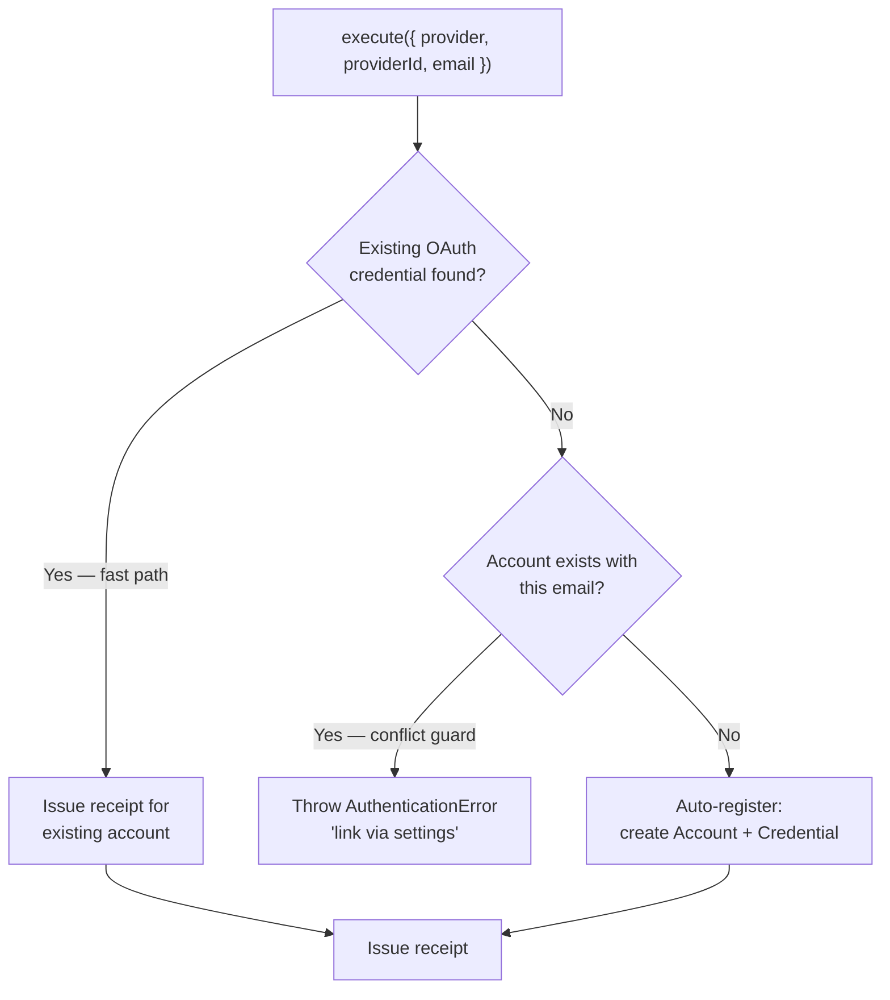

# Architecture — Contributors Only

This document describes whoami's internal structure. If you are consuming the library rather than contributing to it, you do not need this.

## Zone model

whoami uses a strict zone model derived from Clean Architecture. Dependencies only point inward — Zone 3 depends on Zone 2, Zone 2 depends on Zone 1, Zone 1 depends on Zone 0. Zone 0 depends on nothing.

```mermaid
graph TD
    subgraph "Zone 3 — Infrastructure"
        Argon2["argon2 (npm)"]
        Jose["jose (npm)"]
        NestJS["@nestjs/* (npm)"]
    end

    subgraph "Zone 2 — Adapters"
        ArgonAdapter["Argon2PasswordHasher"]
        JoseSigner["JoseReceiptSigner"]
        JoseVerifier["JoseReceiptVerifier"]
        NestModule["WhoamiModule"]
        NestGuard["WhoamiAuthGuard"]
        NestFilter["WhoamiExceptionFilter"]
        OAuthHandler["OAuthCallbackHandler"]
    end

    subgraph "Zone 1 — Application"
        PasswordModule["PasswordModule()"]
        OAuthModule["OAuthModule()"]
        MagicLinkModule["MagicLinkModule()"]
        AuthOrchestrator["AuthOrchestrator"]
        PasswordUseCases["RegisterWithPasswordUseCase\nAuthenticateWithPasswordUseCase\nAddPasswordToAccountUseCase\nChangePasswordUseCase\nRequestPasswordResetUseCase\nVerifyPasswordResetUseCase"]
        OAuthUseCases["AuthenticateWithOAuthUseCase\nLinkOAuthToAccountUseCase\nUnlinkOAuthProviderUseCase"]
        ReceiptUseCases["IssueReceiptUseCase\nVerifyReceiptUseCase"]
    end

    subgraph "Zone 0 — Domain"
        Account["Account entity"]
        Credential["Credential entity"]
        Receipt["Receipt entity"]
        AccountId["AccountId VO"]
        EmailAddress["EmailAddress VO"]
        CredentialId["CredentialId VO"]
        AccountRepo["AccountRepository port"]
        PwdStore["PasswordCredentialStore port"]
        OAuthStore["OAuthCredentialStore port"]
        PasswordHasher["PasswordHasher port"]
        ReceiptSigner["ReceiptSigner port"]
        ReceiptVerifier["ReceiptVerifier port"]
        LoggerPort["LoggerPort"]
        IdGeneratorPort["IdGeneratorPort"]
        ClockPort["ClockPort"]
        SecureTokenPort["SecureTokenPort"]
        Errors["Domain errors (14 types)"]
    end

    Argon2 --> ArgonAdapter
    Jose --> JoseSigner
    Jose --> JoseVerifier
    NestJS --> NestModule
    NestJS --> NestGuard

    ArgonAdapter -.->|implements| PasswordHasher
    JoseSigner -.->|implements| ReceiptSigner
    JoseVerifier -.->|implements| ReceiptVerifier

    NestGuard --> ReceiptUseCases
    NestModule --> PasswordModule
    NestModule --> OAuthModule
    OAuthHandler --> OAuthUseCases

    PasswordModule --> PasswordUseCases
    OAuthModule --> OAuthUseCases

    PasswordUseCases --> AccountRepo
    PasswordUseCases --> PwdStore
    PasswordUseCases --> PasswordHasher
    OAuthUseCases --> AccountRepo
    OAuthUseCases --> OAuthStore
    ReceiptUseCases --> ReceiptSigner
    ReceiptUseCases --> ReceiptVerifier
```



## Zone rules

| Zone | May depend on | May not depend on |
| --- | --- | --- |
| 0 — Domain | Nothing | Zones 1, 2, 3 |
| 1 — Application | Zone 0 | Zones 2, 3 |
| 2 — Adapters | Zones 0, 1 | Zone 3 |
| 3 — Infrastructure | Any | — |

## Module structure

The core is organised into a `kernel` (shared primitives, entities, ports) and per-auth-method `modules`. There is no central factory — each module returns its own fully-typed facade. Cross-module policy lives in `AuthOrchestrator`.

```
packages/core/src/
├── index.ts                     re-exports public surface
├── internal/
│   └── index.ts                 concrete use-case classes (adapter authors only)
├── kernel/
│   ├── domain/                  Account, Credential, Receipt entities + value objects
│   ├── ports/                   AccountRepository, ReceiptSigner, ReceiptVerifier, AuthModule contract
│   └── shared/                  AuthOrchestrator, shared errors, shared ports
└── modules/
    ├── password/                PasswordModule(), PasswordMethods, ports, use cases
    ├── oauth/                   OAuthModule(), OAuthMethods, ports, use cases
    └── magiclink/               MagicLinkModule(), MagicLinkMethods, ports, use cases
```

## Public vs internal API

`@odysseon/whoami-core` exposes two entry points:

| Entry point | Consumer | Contains |
|---|---|---|
| `@odysseon/whoami-core` | Application code | All ports, entities, errors, value objects, module factories, `AuthOrchestrator` |
| `@odysseon/whoami-core/internal` | Adapter authors only | Concrete use-case classes for DI token wiring |

Application code imports module factories and `AuthOrchestrator` only. Use-case classes are implementation details.

## Module Port Ownership Rule

Ports used by only one module live inside that module's directory. The kernel must not define ports for module-specific behaviour. Shared ports (logger, ID generator, clock, secure token) live in `kernel/shared/ports`.

## OAuth security model

`AuthenticateWithOAuthUseCase` implements a three-phase, security-first flow:



The conflict guard prevents OAuth account-takeover: if an account already exists with a given email but has no linked OAuth credential for that provider, the flow rejects. The user must log in with their existing method and link the provider explicitly.

## What whoami deliberately does not own

- **User profiles, roles, permissions** — your domain. Link via `accountId` as a foreign key.
- **Session management** — use your framework's session layer.
- **Refresh tokens** — stateful token rotation requires storage, rotation families, and reuse detection.
- **Magic links (transport)** — one-time token generation is in scope; email delivery is not.
