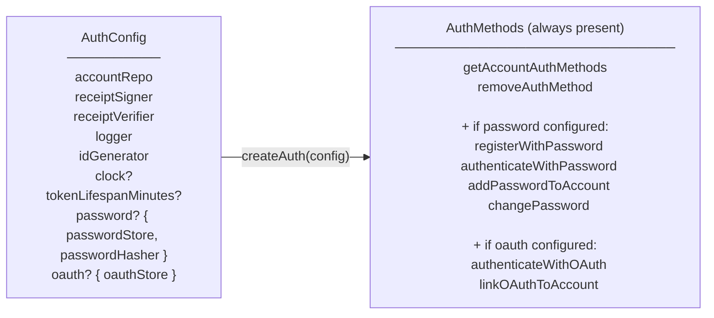
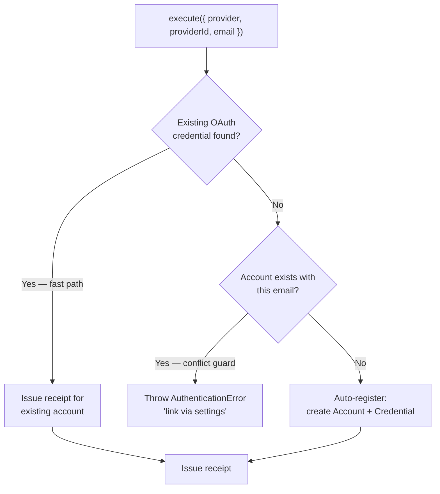

# Architecture

whoami uses a strict zone model derived from Clean Architecture. Dependencies only point inward — Zone 3 depends on Zone 2, Zone 2 depends on Zone 1, Zone 1 depends on Zone 0. Zone 0 depends on nothing.

## Zone model

```mermaid
graph TD
    subgraph "Zone 3 — Infrastructure"
        Argon2["argon2 (npm)"]
        Jose["jose (npm)"]
        NestJS["@nestjs/* (npm)"]
    end

    subgraph "Zone 2 — Adapters"
        ArgonAdapter["Argon2PasswordHasher"]
        JoseSigner["JoseReceiptSigner"]
        JoseVerifier["JoseReceiptVerifier"]
        NestModule["WhoamiModule"]
        NestGuard["WhoamiAuthGuard"]
        NestFilter["WhoamiExceptionFilter"]
        OAuthHandler["OAuthCallbackHandler"]
    end

    subgraph "Zone 1 — Application"
        CreateAuth["createAuth() factory"]
        RegisterUC["RegisterWithPasswordUseCase"]
        AuthPwdUC["AuthenticateWithPasswordUseCase"]
        AuthOAuthUC["AuthenticateWithOAuthUseCase"]
        AddPwdUC["AddPasswordUseCase"]
        ChangePwdUC["ChangePasswordUseCase"]
        LinkOAuthUC["LinkOAuthToAccountUseCase"]
        RemoveUC["RemoveAuthMethodUseCase"]
        IssueUC["IssueReceiptUseCase"]
        VerifyUC["VerifyReceiptUseCase"]
    end

    subgraph "Zone 0 — Domain"
        Account["Account entity"]
        Credential["Credential entity"]
        Receipt["Receipt entity"]
        AccountId["AccountId VO"]
        EmailAddress["EmailAddress VO"]
        CredentialId["CredentialId VO"]
        AccountRepo["AccountRepository port"]
        PwdStore["PasswordCredentialStore port"]
        OAuthStore["OAuthCredentialStore port"]
        PasswordHasher["PasswordHasher port"]
        ReceiptSigner["ReceiptSigner port"]
        ReceiptVerifier["ReceiptVerifier port"]
        LoggerPort["LoggerPort"]
        IdGeneratorPort["IdGeneratorPort"]
        ClockPort["ClockPort"]
        Errors["Domain errors"]
    end

    Argon2 --> ArgonAdapter
    Jose --> JoseSigner
    Jose --> JoseVerifier
    NestJS --> NestModule
    NestJS --> NestGuard

    ArgonAdapter -.->|implements| PasswordHasher
    JoseSigner -.->|implements| ReceiptSigner
    JoseVerifier -.->|implements| ReceiptVerifier

    NestGuard --> VerifyUC
    NestModule --> CreateAuth
    OAuthHandler --> CreateAuth

    CreateAuth --> RegisterUC
    CreateAuth --> AuthPwdUC
    CreateAuth --> AuthOAuthUC
    CreateAuth --> AddPwdUC
    CreateAuth --> ChangePwdUC
    CreateAuth --> LinkOAuthUC
    CreateAuth --> RemoveUC
    CreateAuth --> IssueUC
    CreateAuth --> VerifyUC

    RegisterUC --> AccountRepo
    RegisterUC --> PwdStore
    AuthPwdUC --> AccountRepo
    AuthPwdUC --> PwdStore
    AuthPwdUC --> PasswordHasher
    AuthOAuthUC --> AccountRepo
    AuthOAuthUC --> OAuthStore
    AddPwdUC --> AccountRepo
    AddPwdUC --> PwdStore
    AddPwdUC --> PasswordHasher
    ChangePwdUC --> PwdStore
    ChangePwdUC --> PasswordHasher
    LinkOAuthUC --> AccountRepo
    LinkOAuthUC --> OAuthStore
    RemoveUC --> PwdStore
    RemoveUC --> OAuthStore
    IssueUC --> ReceiptSigner
    VerifyUC --> ReceiptVerifier

    RegisterUC --> Account
    AuthOAuthUC --> Account
    AuthOAuthUC --> Credential
    AuthPwdUC --> Credential
    IssueUC --> Receipt
    VerifyUC --> Receipt
```



## Zone rules

| Zone               | May depend on | May not depend on |
| ------------------ | ------------- | ----------------- |
| 0 — Domain         | Nothing       | Zones 1, 2, 3     |
| 1 — Application    | Zone 0        | Zones 2, 3        |
| 2 — Adapters       | Zones 0, 1    | Zone 3            |
| 3 — Infrastructure | Any           | —                 |

## Public vs internal API

`@odysseon/whoami-core` exposes two entry points:

| Entry point | Consumer | Contains |
|---|---|---|
| `@odysseon/whoami-core` | Application code | `createAuth`, all ports, entities, errors, value objects |
| `@odysseon/whoami-core/internal` | Adapter authors only | Concrete use-case classes for DI token wiring |

Application code should only call `createAuth` and never import use-case classes directly — they are implementation details and may change without notice.

## Module structure

The core is organised into a `kernel` (shared primitives, entities, orchestration) and per-auth-method `modules`:

```
packages/core/src/
├── index.ts                     re-exports public surface
├── api/
│   ├── public.ts                public entry point
│   └── internal.ts              internal entry point (concrete use-case classes)
├── internal/
│   └── index.ts                 re-exports api/internal.ts
├── composition/
│   ├── create-auth.ts           createAuth() factory — wires all modules together
│   ├── context-builder.ts       buildCoreContext() — shared infra passed to modules
│   └── types.ts                 AuthConfig, AuthMethods, AuthMethodKey, CoreAuthMethods
├── kernel/
│   ├── account/                 Account entity, AccountRepository port
│   ├── auth/
│   │   ├── auth-method.port.ts  AuthMethod, AuthMethodPort
│   │   ├── auth-orchestrator.ts AuthOrchestrator — queries method existence and count
│   │   ├── auth-result.type.ts  AuthResult
│   │   └── usecases/
│   │       └── remove-auth-method.usecase.ts  Last-credential guard + module delegation
│   ├── credential/              Credential entity, CredentialProof types
│   ├── receipt/                 Receipt entity, ReceiptSigner/Verifier ports, use cases
│   └── shared/
│       ├── errors/              DomainError hierarchy (14 error types)
│       ├── ports/               LoggerPort, IdGeneratorPort, ClockPort
│       └── value-objects/       AccountId, EmailAddress, CredentialId
└── modules/
    ├── module.interface.ts      AuthModule<Config, Methods> contract
    ├── password/                PasswordConfig, PasswordMethods, use cases, ports
    └── oauth/                   OAuthConfig, OAuthMethods, use cases, ports
```

## createAuth — the composition facade

`createAuth(config: AuthConfig): AuthMethods` is the primary entry point. Methods are present only when the corresponding config section is provided:



## RemoveAuthMethodUseCase — last-credential invariant

`auth.removeAuthMethod(accountId, method, options?)` is the only correct way to remove any credential from an account. Before delegating to a module's remover, the kernel counts how many total credentials would remain across all active methods. If the result would be zero, it throws `CannotRemoveLastCredentialError` — no deletion occurs.

For OAuth, pass `{ provider }` in `options` to target a single linked provider rather than all OAuth credentials for the account.

## OAuth security model

`AuthenticateWithOAuthUseCase` implements a three-phase security-first flow:



The conflict guard prevents OAuth account-takeover: if an account already exists with a given email but has no linked OAuth credential for that provider, the flow rejects. The user must log in with their existing method and link the provider via `linkOAuthToAccount`.

## What whoami deliberately does not own

- **User profiles, roles, permissions** — your domain. Link via `accountId` as a foreign key.
- **Session management** — use your framework's session layer.
- **Refresh tokens** — stateful token rotation requires storage, rotation families, and reuse detection. That is a consumer concern, not an identity primitive.
- **Magic links** — one-time token flows require transport-layer integration (email). Implement as a thin use case in your application, calling `createAuth` for the receipt step.
