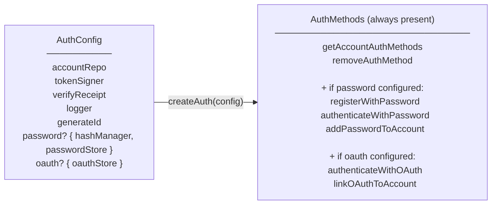
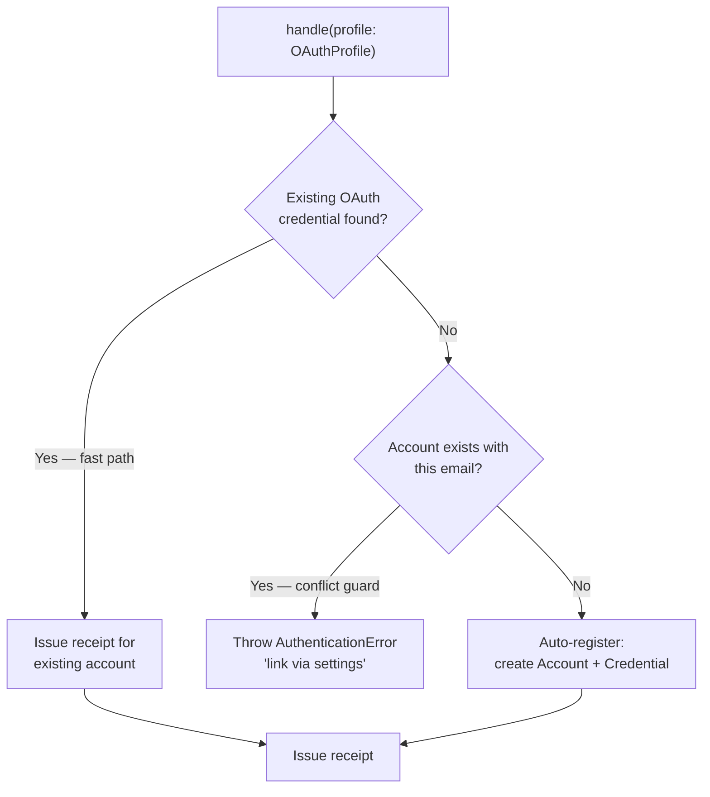

# Architecture

whoami uses a strict zone model derived from Clean Architecture. Dependencies only point inward — Zone 3 depends on Zone 2, Zone 2 depends on Zone 1, Zone 1 depends on Zone 0. Zone 0 depends on nothing.

## Zone model

```mermaid
graph TD
    subgraph "Zone 3 — Infrastructure"
        Argon2["argon2 (npm)"]
        Jose["jose (npm)"]
        WebCrypto["globalThis.crypto (built-in)"]
        NestJS["@nestjs/* (npm)"]
    end

    subgraph "Zone 2 — Adapters"
        ArgonAdapter["Argon2PasswordHasher"]
        JoseSigner["JoseReceiptSigner"]
        JoseVerifier["JoseReceiptVerifier"]
        WebCryptoAdapter["WebCryptoTokenHasher"]
        NestModule["WhoamiModule"]
        NestGuard["WhoamiAuthGuard"]
        NestFilter["WhoamiExceptionFilter"]
        OAuthHandler["OAuthCallbackHandler"]
    end

    subgraph "Zone 1 — Application"
        CreateAuth["createAuth() factory"]
        RegisterUC["RegisterWithPasswordUseCase"]
        AuthPwdUC["AuthenticateWithPasswordUseCase"]
        AuthOAuthUC["AuthenticateOAuthUseCase"]
        AddPwdUC["AddPasswordAuthUseCase"]
        LinkOAuthUC["LinkOAuthToAccountUseCase"]
        RemovePwdUC["RemovePasswordUseCase"]
        RegisterAccountUC["RegisterAccountUseCase"]
        IssueUC["IssueReceiptUseCase"]
        VerifyUC["VerifyReceiptUseCase"]
    end

    subgraph "Zone 0 — Domain"
        Account["Account entity"]
        Credential["Credential entity"]
        Receipt["Receipt entity"]
        AccountId["AccountId VO"]
        EmailAddress["EmailAddress VO"]
        CredentialId["CredentialId VO"]
        AccountRepo["AccountRepository port"]
        PwdStore["PasswordCredentialStore port"]
        OAuthStore["OAuthCredentialStore port"]
        PasswordMgr["PasswordManager port"]
        TokenHasher["TokenHasher port"]
        ReceiptSigner["ReceiptSigner port"]
        ReceiptVerifier["ReceiptVerifier port"]
        LoggerPort["LoggerPort"]
        Errors["Domain errors"]
    end

    Argon2 --> ArgonAdapter
    Jose --> JoseSigner
    Jose --> JoseVerifier
    WebCrypto --> WebCryptoAdapter
    NestJS --> NestModule
    NestJS --> NestGuard

    ArgonAdapter -.->|implements| PasswordMgr
    JoseSigner -.->|implements| ReceiptSigner
    JoseVerifier -.->|implements| ReceiptVerifier
    WebCryptoAdapter -.->|implements| TokenHasher

    NestGuard --> VerifyUC
    NestModule --> CreateAuth
    NestModule --> VerifyUC
    OAuthHandler --> CreateAuth

    CreateAuth --> RegisterUC
    CreateAuth --> AuthPwdUC
    CreateAuth --> AuthOAuthUC
    CreateAuth --> AddPwdUC
    CreateAuth --> LinkOAuthUC
    CreateAuth --> RemovePwdUC

    RegisterUC --> AccountRepo
    RegisterUC --> PwdStore
    AuthPwdUC --> PwdStore
    AuthPwdUC --> PasswordMgr
    AuthOAuthUC --> AccountRepo
    AuthOAuthUC --> OAuthStore
    AddPwdUC --> PwdStore
    AddPwdUC --> AccountRepo
    AddPwdUC --> PasswordMgr
    LinkOAuthUC --> AccountRepo
    LinkOAuthUC --> OAuthStore
    LinkOAuthUC --> VerifyUC
    RemovePwdUC --> PwdStore
    IssueUC --> ReceiptSigner
    VerifyUC --> ReceiptVerifier

    RegisterUC --> Account
    AuthOAuthUC --> Account
    AuthOAuthUC --> Credential
    AuthPwdUC --> Credential
    IssueUC --> Receipt
    VerifyUC --> Receipt
```



## Zone rules

| Zone               | May depend on | May not depend on |
| ------------------ | ------------- | ----------------- |
| 0 — Domain         | Nothing       | Zones 1, 2, 3     |
| 1 — Application    | Zone 0        | Zones 2, 3        |
| 2 — Adapters       | Zones 0, 1    | Zone 3            |
| 3 — Infrastructure | Any           | —                 |

## Public vs internal API

`@odysseon/whoami-core` exposes two entry points:

| Entry point | Consumer | Contains |
|---|---|---|
| `@odysseon/whoami-core` | Application code | `createAuth`, all ports, entities, errors, value objects |
| `@odysseon/whoami-core/internal` | Adapter authors only | Concrete use-case classes for DI token wiring |

Application code should only call `createAuth` and never import use-case classes directly — they are implementation details and may change without notice.

## Feature structure

The core is organised by feature, not by layer:

```
packages/core/src/
├── whoami.ts               createAuth() factory facade
├── types.ts                AuthConfig, AuthMethods, AuthMethod types
├── index.ts                Public API re-exports
├── internal/
│   └── index.ts            Internal re-exports (use-case classes for adapters)
├── features/
│   ├── accounts/           Register and retrieve accounts
│   │   ├── application/    RegisterAccountUseCase
│   │   ├── domain/         Account entity, AccountRepository port
│   │   └── index.ts
│   ├── authentication/     Authenticate via password or OAuth
│   │   ├── add-password-auth.usecase.ts
│   │   ├── authenticate-oauth.usecase.ts
│   │   ├── authenticate-password.usecase.ts
│   │   └── index.ts
│   ├── credentials/        Manage credential lifecycle
│   │   ├── application/    RegisterWithPasswordUseCase, RemovePasswordUseCase,
│   │   │                   LinkOAuthToAccountUseCase
│   │   ├── domain/         Credential entity, PasswordCredentialStore port,
│   │   │                   OAuthCredentialStore port, PasswordManager port,
│   │   │                   TokenHasher port, CredentialProof types
│   │   └── index.ts
│   └── receipts/           Issue and verify signed receipt tokens
│       ├── application/    IssueReceiptUseCase, VerifyReceiptUseCase
│       ├── domain/         Receipt entity, ReceiptSigner port, ReceiptVerifier port
│       └── index.ts
└── shared/
    ├── domain/
    │   ├── errors/         DomainError hierarchy (14 error types)
    │   ├── ports/          LoggerPort
    │   └── value-objects/  AccountId, EmailAddress, CredentialId
    └── index.ts
```

Each feature exposes its public surface through its own `index.ts`. Nothing crosses feature boundaries except through exported types.

## createAuth — the composition facade

`createAuth(config: AuthConfig): AuthMethods` is the primary entry point. It composes all use-cases into a single object. Methods are present only when the corresponding config section is provided:



## OAuth security model

`AuthenticateOAuthUseCase` implements a three-phase security-first flow:



The conflict guard prevents OAuth account-takeover: if an account already exists with a given email but has no linked OAuth credential for that provider, the flow rejects. The user must log in with their existing method and link the provider via settings.

## What whoami deliberately does not own

- **User profiles, roles, permissions** — your domain. Link via `accountId` as a foreign key.
- **Session management** — use your framework's session layer.
- **Refresh tokens** — stateful token rotation requires storage, rotation families, and reuse detection. That is a consumer concern, not an identity primitive.
- **Magic links** — one-time token flows require transport-layer integration (email). Implement as a thin use case in your application calling `createAuth` for the receipt step.
