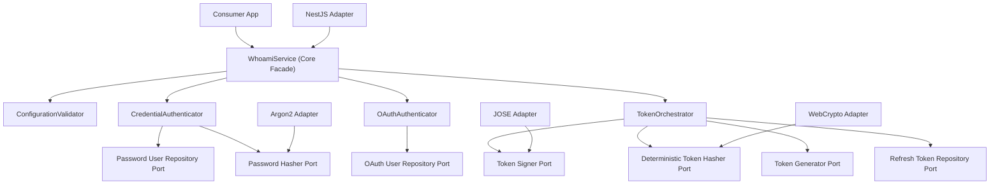

# Architecture

## Architecture

Whoami uses a hexagonal layout. The core package owns the authentication rules and contracts, while adapters implement framework and crypto details outside the domain.

## Core Responsibilities

- `ConfigurationValidator` fails fast when a dependency is present without an explicit feature flag.
- `CredentialAuthenticator` manages registration, password login, and password updates.
- `OAuthAuthenticator` manages provider login and provider linking.
- `TokenOrchestrator` issues access tokens, rotates refresh tokens, and detects reuse.

## Type Boundaries

- User entities must satisfy `HasId`, and `id` may be either `string` or `number`.
- Repository ports preserve the concrete `TEntity["id"]` type end to end.
- The JOSE adapter serializes numeric IDs into JWT-safe strings and restores them on verification so the core can still work with `number` IDs safely.
