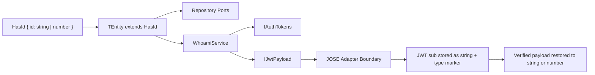

# Type Model

## Type Model

This project treats the user ID as a consumer-owned type with one explicit constraint: it must be either a `string` or a `number`.

## Rules

- `HasId["id"]` is the source of truth for identity typing.
- `WhoamiService<TEntity>` preserves the repository ID type through registration, OAuth linking, password updates, and token refresh.
- Refresh-token persistence uses the same ID type as the user repository instead of hard-coding `string`.
- JWT handling is the only place where the ID crosses a format boundary. Numeric IDs are encoded safely for JWT transport and restored during verification.

## Why This Matters

- Consumers with numeric database IDs do not need casts.
- Consumers with string IDs keep their exact type.
- Adapters do not silently coerce IDs into a different domain shape.
