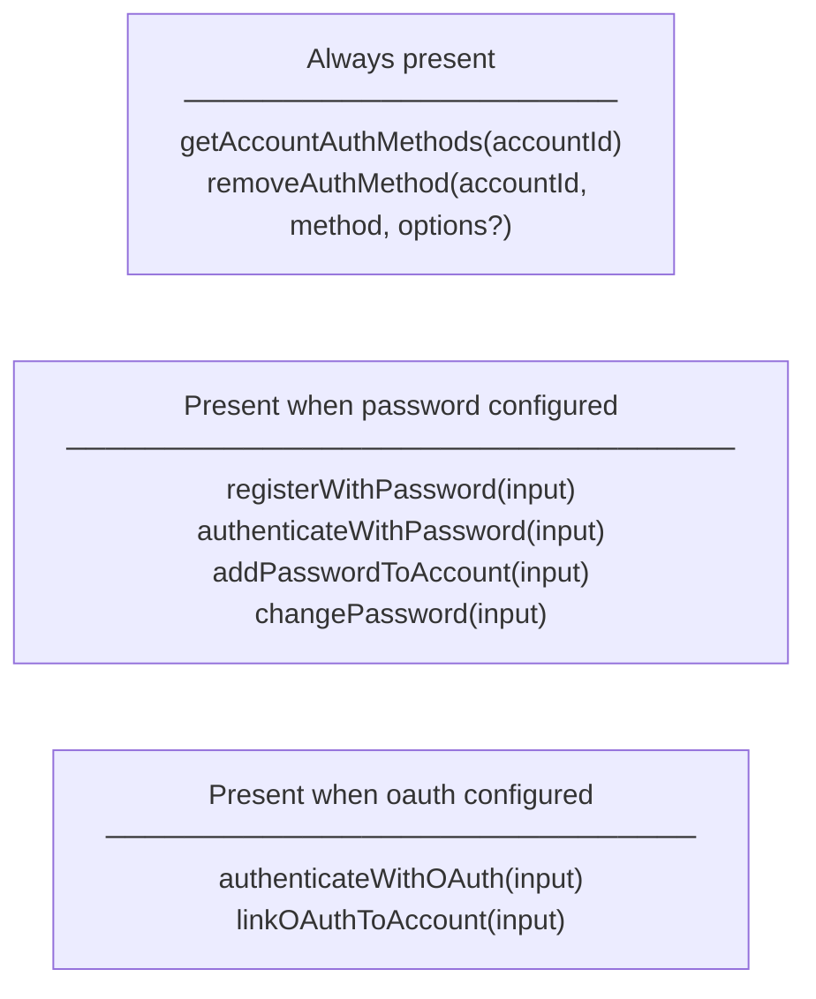
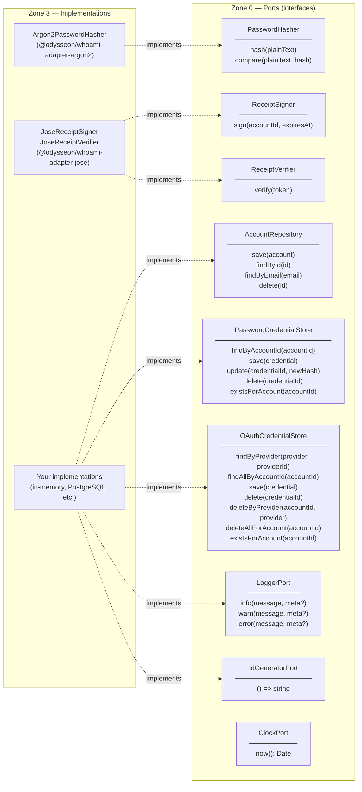

# Type Model

## AccountId

Accepts a non-empty `string`. The `.value` property always returns the normalised string.

```ts
new AccountId("user-uuid"); // value is "user-uuid"
new AccountId("");          // throws InvalidAccountIdError
```

Use `accountId.value` as the foreign key in your `users` table.

## EmailAddress

Normalises on construction (lowercase, trimmed). The `.value` property always returns the normalised string.

```ts
const email = new EmailAddress("  User@Example.COM  ");
email.value; // "user@example.com"

new EmailAddress(""); // throws InvalidEmailError
```

## Receipt

The output of a successful authentication. Contains everything a route handler needs to identify the request.

```ts
class Receipt {
  token: string;        // the signed JWT
  accountId: AccountId; // the authenticated account
  expiresAt: Date;      // when the token expires
}
```

`WhoamiAuthGuard` stores a verified `Receipt` on `request.identity`. `@CurrentIdentity()` resolves it in route handlers.


## CredentialProof

A discriminated union stored inside a `Credential` entity. Each credential holds exactly one proof kind. Two kinds are currently supported:

```ts
type CredentialProof =
  | { kind: "password"; hash: string }
  | { kind: "oauth"; provider: string; providerId: string };
```

New credentials should be created through the `Credential` factory methods:

- `Credential.createPassword({ id, accountId, hash })`
- `Credential.createOAuth({ id, accountId, provider, providerId })`

`Credential.loadExisting(...)` is intended for rehydrating persisted credentials only.

Calling a proof accessor that doesn't match the stored kind throws `WrongCredentialTypeError` — no silent fallthrough.

## AuthConfig and AuthMethods

`createAuth(config: AuthConfig): AuthMethods` is the primary factory. Configure only the sections your application needs:

```ts
interface AuthConfig {
  accountRepo: AccountRepository;        // required
  receiptSigner: ReceiptSigner;          // required — mints receipt tokens
  receiptVerifier: ReceiptVerifier;      // required — validates receipt tokens
  logger: LoggerPort;                    // required
  idGenerator: IdGeneratorPort;          // required — e.g. () => crypto.randomUUID()
  clock?: ClockPort;                     // optional — override Date.now() for testing
  tokenLifespanMinutes?: number;         // optional, default 60

  password?: {                           // omit to disable password auth
    passwordStore: PasswordCredentialStore;
    passwordHasher: PasswordHasher;
  };

  oauth?: {                              // omit to disable OAuth auth
    oauthStore: OAuthCredentialStore;
  };
}
```

The returned `AuthMethods` facade has methods that are always present and methods that are only present when the corresponding section is configured:



### Removing an auth method

All credential removal must go through `removeAuthMethod`. The kernel enforces the last-credential invariant before any deletion occurs.

```ts
// Remove password auth
await auth.removeAuthMethod(accountId, "password");

// Unlink a specific OAuth provider
await auth.removeAuthMethod(accountId, "oauth", { provider: "google" });

// Remove all OAuth credentials
await auth.removeAuthMethod(accountId, "oauth");
```

## Domain errors

All domain errors extend `DomainError`. Switch on `err.code` — codes are stable API, messages are for humans and may change.

```ts
try {
  await auth.registerWithPassword(input);
} catch (err) {
  if (err instanceof DomainError) {
    switch (err.code) {
      case "ACCOUNT_ALREADY_EXISTS": ...
      case "INVALID_EMAIL": ...
    }
  }
}
```

Full error table:

| Error class | Code | Thrown when |
|---|---|---|
| `AccountAlreadyExistsError` | `ACCOUNT_ALREADY_EXISTS` | Registering an email that already has an account |
| `AccountNotFoundError` | `ACCOUNT_NOT_FOUND` | A use case looks up an account by ID and finds none |
| `AuthenticationError` | `AUTHENTICATION_ERROR` | Credential verification fails (intentionally vague to prevent enumeration) |
| `WrongCredentialTypeError` | `WRONG_CREDENTIAL_TYPE` | Accessing a proof field that doesn't match the credential's kind — indicates a server-side bug |
| `InvalidReceiptError` | `INVALID_RECEIPT` | Receipt token is empty, expired, or fails signature verification |
| `InvalidEmailError` | `INVALID_EMAIL` | Constructing `EmailAddress` with an invalid value |
| `InvalidConfigurationError` | `INVALID_CONFIGURATION` | A use case is constructed with an invalid config value |
| `InvalidCredentialError` | `INVALID_CREDENTIAL` | A credential factory receives an empty proof field |
| `InvalidAccountIdError` | `INVALID_ACCOUNT_ID` | Constructing `AccountId` with an empty value |
| `InvalidCredentialIdError` | `INVALID_CREDENTIAL_ID` | Constructing `CredentialId` with an empty value |
| `CredentialAlreadyExistsError` | `CREDENTIAL_ALREADY_EXISTS` | Attempting to add a password to an account that already has one |
| `OAuthProviderNotFoundError` | `OAUTH_PROVIDER_NOT_FOUND` | Removing an OAuth provider that is not linked to the account |
| `CannotRemoveLastCredentialError` | `CANNOT_REMOVE_LAST_CREDENTIAL` | Removing the last auth method would lock the account permanently |
| `UnsupportedAuthMethodError` | `UNSUPPORTED_AUTH_METHOD` | `removeAuthMethod` called for a method that is not configured |

`WhoamiExceptionFilter` (NestJS adapter) maps these codes to HTTP status codes automatically.

## Port interfaces

Ports are the boundary contracts that Zone 0 defines and Zone 3 implements.


