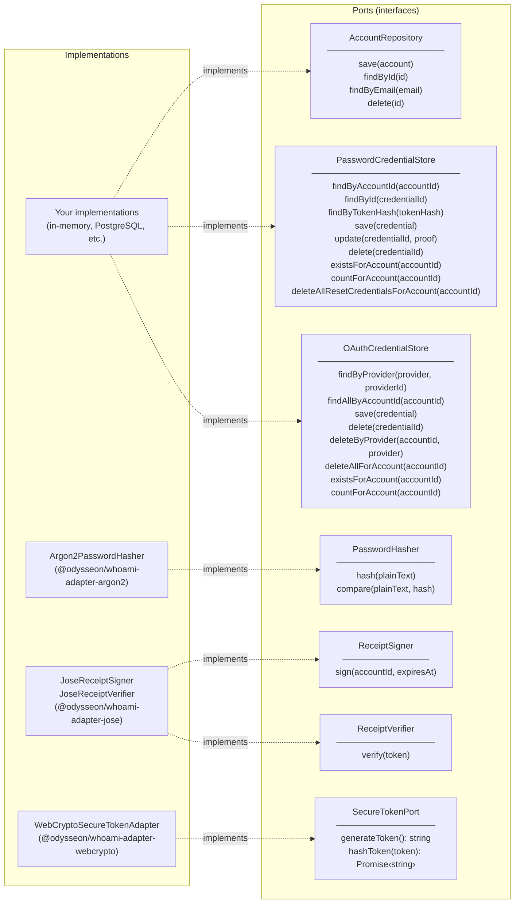

# Type Model

## AccountId

Accepts a non-empty `string`. It is a branded `string` type, so it carries no runtime overhead and does not have a `.value` property.

```ts
const accountId = createAccountId("user-uuid");
console.log(accountId); // "user-uuid"

createAccountId(""); // throws InvalidAccountIdError
```

Use `accountId` directly as the foreign key in your `users` table.

## EmailAddress

Normalises on construction (lowercase, trimmed). It is a branded `string`.

```ts
const email = createEmailAddress("  User@Example.COM  ");
console.log(email); // "user@example.com"

createEmailAddress(""); // throws InvalidEmailError
```

## Receipt

The output of a successful authentication. Contains everything a route handler needs to identify the request.

```ts
class Receipt {
  token: string;        // the signed JWT
  accountId: AccountId; // the authenticated account
  expiresAt: Date;      // when the token expires
}
```

In NestJS, `WhoamiAuthGuard` verifies the `Receipt` and strips the sensitive token before storing it. It stores a `RequestIdentity` on `request.whoami.identity`. `@CurrentIdentity()` resolves it in route handlers.


## CredentialProof

A discriminated union stored inside a `Credential` entity. Each credential holds exactly one proof kind:

```ts
type CredentialProof =
  | { kind: "password"; hash: string }
  | { kind: "oauth"; provider: string; providerId: string }
  | { kind: "magic-link"; tokenHash: string; expiresAt: Date };
```

New credentials should be created through `Credential` factory methods:

- `Credential.createPassword({ id, accountId, hash })`
- `Credential.createOAuth({ id, accountId, provider, providerId })`
- `Credential.createMagicLink({ id, accountId, tokenHash, expiresAt })`

`Credential.loadExisting(...)` is intended for rehydrating persisted credentials only.

Calling a proof accessor that doesn't match the stored kind throws `WrongCredentialTypeError` — no silent fallthrough.

## Module return types

Each module factory returns a fully-typed facade. No inference, no widening, no casts.

```ts
const { account } = await password.registerWithPassword({ email, password });
// account.id    → string ✅
// account.email → string ✅

const { receipt } = await password.authenticateWithPassword({ email, password });
// receipt.token     → string ✅
// receipt.accountId → AccountId ✅
// receipt.expiresAt → Date ✅

const result = await password.requestPasswordReset({ email });
// result.plainTextToken → string (deliver via email) ✅
// result.challengeId → string ✅
// result.expiresAt → Date ✅
```

## Domain errors

All domain errors extend `DomainError`. Switch on `err.code` — codes are stable API, messages are for humans and may change.

```ts
try {
  await password.registerWithPassword(input);
} catch (err) {
  if (err instanceof DomainError) {
    switch (err.code) {
      case "ACCOUNT_ALREADY_EXISTS": ...
      case "INVALID_EMAIL": ...
    }
  }
}
```

Full error table in [`packages/core/README.md`](../packages/core/README.md#domain-errors).

## DomainErrorCategory

Core errors do **not** carry HTTP status codes. They carry a semantic `DomainErrorCategory`. This is a load-bearing architectural constraint ensuring the domain remains completely agnostic to the transport layer.

```ts
export type DomainErrorCategory =
  | "BAD_REQUEST"
  | "UNAUTHORIZED"
  | "NOT_FOUND"
  | "CONFLICT"
  | "UNPROCESSABLE"
  | "INTERNAL";
```

Adapters (like the Express error handler or NestJS exception filter) map these categories to the appropriate HTTP status code. If you switch from HTTP to WebSockets or gRPC, the domain errors remain exactly the same.

## Port interfaces

Ports are the boundary contracts that your infrastructure must implement. A concise reference:


