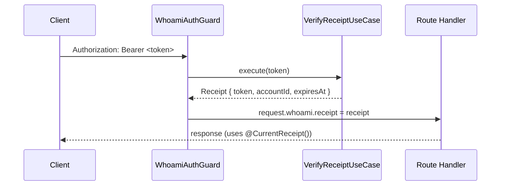
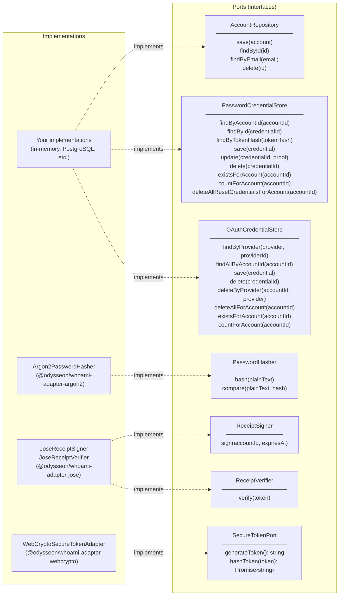

# Type Model

## AccountId

Accepts a non-empty `string`. The `.value` property always returns the normalised string.

```ts
new AccountId("user-uuid"); // value is "user-uuid"
new AccountId("");          // throws InvalidAccountIdError
```

Use `accountId.value` as the foreign key in your `users` table.

## EmailAddress

Normalises on construction (lowercase, trimmed). The `.value` property always returns the normalised string.

```ts
const email = new EmailAddress("  User@Example.COM  ");
email.value; // "user@example.com"

new EmailAddress(""); // throws InvalidEmailError
```

## Receipt

The output of a successful authentication. Contains everything a route handler needs to identify the request.

```ts
class Receipt {
  token: string;        // the signed JWT
  accountId: AccountId; // the authenticated account
  expiresAt: Date;      // when the token expires
}
```

In NestJS, `WhoamiAuthGuard` stores a verified `Receipt` on `request.whoami.receipt`. `@CurrentReceipt()` resolves it in route handlers.



## CredentialProof

A discriminated union stored inside a `Credential` entity. Each credential holds exactly one proof kind:

```ts
type CredentialProof =
  | { kind: "password"; hash: string }
  | { kind: "oauth"; provider: string; providerId: string }
  | { kind: "magic-link"; tokenHash: string; expiresAt: Date };
```

New credentials should be created through `Credential` factory methods:

- `Credential.createPassword({ id, accountId, hash })`
- `Credential.createOAuth({ id, accountId, provider, providerId })`
- `Credential.createMagicLink({ id, accountId, tokenHash, expiresAt })`

`Credential.loadExisting(...)` is intended for rehydrating persisted credentials only.

Calling a proof accessor that doesn't match the stored kind throws `WrongCredentialTypeError` — no silent fallthrough.

## Module return types

Each module factory returns a fully-typed facade. No inference, no widening, no casts.

```ts
const { account } = await password.registerWithPassword({ email, password });
// account.id    → string ✅
// account.email → string ✅

const { receipt } = await password.authenticateWithPassword({ email, password });
// receipt.token     → string ✅
// receipt.accountId → AccountId ✅
// receipt.expiresAt → Date ✅

const { token } = await password.requestPasswordReset({ email });
// token → string (plaintext — deliver via email, store the hash) ✅
```

## Domain errors

All domain errors extend `DomainError`. Switch on `err.code` — codes are stable API, messages are for humans and may change.

```ts
try {
  await password.registerWithPassword(input);
} catch (err) {
  if (err instanceof DomainError) {
    switch (err.code) {
      case "ACCOUNT_ALREADY_EXISTS": ...
      case "INVALID_EMAIL": ...
    }
  }
}
```

Full error table in [`packages/core/README.md`](../packages/core/README.md#domain-errors).

## Port interfaces

Ports are the boundary contracts that your infrastructure must implement. A concise reference:


