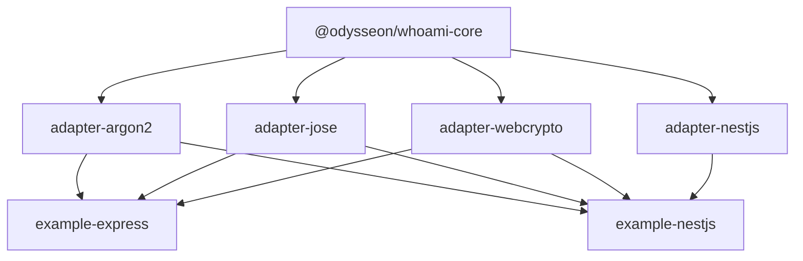

# Packages

## Delegated Responsibility

This directory groups the independently publishable packages and runnable examples that make up the Whoami ecosystem.

## Purpose And Content

- `core` defines the authentication domain, contracts, and orchestration use cases.
- `adapter-argon2` implements the `PasswordHasher` port using Argon2.
- `adapter-jose` implements the `ReceiptSigner` and `ReceiptVerifier` ports using the JOSE library.
- `adapter-webcrypto` implements the `TokenHasher` port using the native Web Crypto API.
- `adapter-nestjs` implements the NestJS integration layer (`WhoamiModule`, `WhoamiAuthGuard`, `WhoamiExceptionFilter`).
- `example-express` is a runnable Express app demonstrating all adapters with in-memory stores.
- `example-nestjs` is a runnable NestJS app demonstrating all adapters wired through the DI container.

## Local Flow

- Applications depend on `core`.
- Adapters satisfy the ports exported by `core`.
- Framework-specific packages consume the same contracts instead of duplicating domain logic.
- Example packages show how to wire adapters together for common server frameworks.
