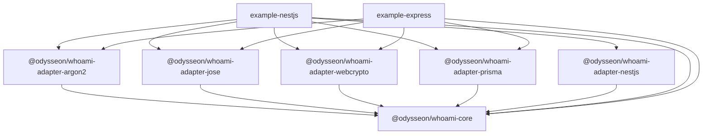

# Packages

| Package                                            | npm scope                            | Description                                                         |
| -------------------------------------------------- | ------------------------------------ | ------------------------------------------------------------------- |
| [`core`](core/README.md)                           | `@odysseon/whoami-core`              | Domain logic, port interfaces, module factories, `AuthOrchestrator` |
| [`adapter-argon2`](adapter-argon2/README.md)       | `@odysseon/whoami-adapter-argon2`    | `PasswordHasher` via argon2                                         |
| [`adapter-jose`](adapter-jose/README.md)           | `@odysseon/whoami-adapter-jose`      | `ReceiptSigner` / `ReceiptVerifier` via jose (HS256 JWT)            |
| [`adapter-webcrypto`](adapter-webcrypto/README.md) | `@odysseon/whoami-adapter-webcrypto` | `SecureTokenPort` via native Web Crypto API                         |
| [`adapter-prisma`](adapter-prisma/README.md)       | `@odysseon/whoami-adapter-prisma`    | Prisma implementations of all whoami store ports                    |
| [`adapter-nestjs`](adapter-nestjs/README.md)       | `@odysseon/whoami-adapter-nestjs`    | NestJS module, guard, decorators, exception filter, OAuth handler   |
| [`example-nestjs`](example-nestjs/README.md)       | `@odysseon/whoami-example-nestjs`    | NestJS 11 reference app                                             |
| [`example-express`](example-express/README.md)     | `@odysseon/whoami-example-express`   | Express 5 reference app                                             |

## Dependency graph

