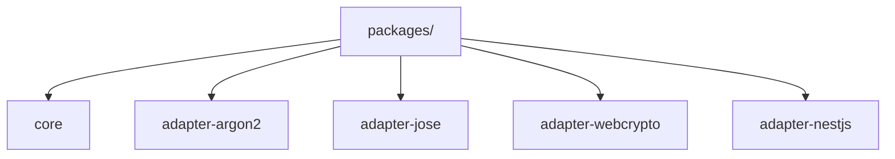

# Packages

## Delegated Responsibility

This directory is responsible for grouping the independently publishable packages that make up the Whoami ecosystem.

## Purpose And Content

- `core` defines the authentication domain, contracts, and orchestration.
- `adapter-argon2` manages password hashing.
- `adapter-jose` manages JWT signing and verification.
- `adapter-webcrypto` manages deterministic token hashing for refresh tokens.
- `adapter-nestjs` manages NestJS integration points.

## Local Flow

- Applications depend on `core`.
- Adapters satisfy the ports exported by `core`.
- Framework-specific packages consume the same contracts instead of duplicating domain logic.
