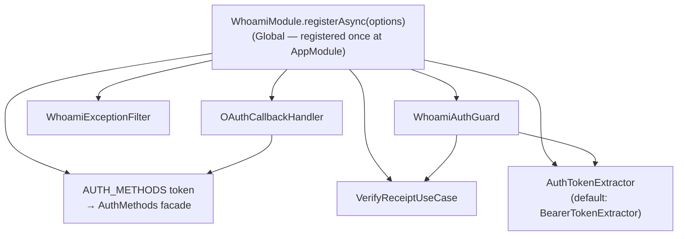

# @odysseon/whoami-adapter-nestjs

NestJS integration for `@odysseon/whoami-core`. Provides a single `WhoamiModule` that wires the full auth facade into the NestJS DI container.

## Installation

```bash
npm install @odysseon/whoami-core @odysseon/whoami-adapter-nestjs
# plus receipt adapters:
npm install @odysseon/whoami-adapter-jose
# optional — for password auth:
npm install @odysseon/whoami-adapter-argon2
```

---

## Module overview



All providers are exported so they are available globally once the module is registered.

---

## WhoamiModule — full setup

Register once at the root `AppModule` level with `registerAsync`. The options object is an `AuthConfig` (passed to `createAuth` internally) plus an optional `tokenExtractor` override:

```ts
// app.module.ts
import { Module } from "@nestjs/common";
import { ConfigModule, ConfigService } from "@nestjs/config";
import { APP_GUARD } from "@nestjs/core";
import { WhoamiModule, WhoamiAuthGuard } from "@odysseon/whoami-adapter-nestjs";
import {
  JoseReceiptSigner,
  JoseReceiptVerifier,
} from "@odysseon/whoami-adapter-jose";
import { Argon2PasswordHasher } from "@odysseon/whoami-adapter-argon2";
import {
  IssueReceiptUseCase,
  VerifyReceiptUseCase,
} from "@odysseon/whoami-core/internal";

@Module({
  imports: [
    ConfigModule.forRoot(),
    WhoamiModule.registerAsync({
      imports: [ConfigModule],
      inject: [ConfigService],
      useFactory: (config: ConfigService) => {
        const secret = config.get("JWT_SECRET")!;
        return {
          accountRepo: new InMemoryAccountRepository(),
          tokenSigner: new IssueReceiptUseCase({
            signer: new JoseReceiptSigner({ secret, issuer: "my-app" }),
            tokenLifespanMinutes: 60,
          }),
          verifyReceipt: new VerifyReceiptUseCase(
            new JoseReceiptVerifier({ secret, issuer: "my-app" }),
          ),
          logger: console,
          generateId: () => crypto.randomUUID(),
          password: {
            hashManager: new Argon2PasswordHasher(),
            passwordStore: new MyPasswordCredentialStore(),
          },
          oauth: {
            oauthStore: new MyOAuthCredentialStore(),
          },
        };
      },
    }),
  ],
  providers: [{ provide: APP_GUARD, useClass: WhoamiAuthGuard }],
})
export class AppModule {}
```

### Verify-only setup (guard only, no auth flows)

If you handle auth flows in a separate service and only need the guard:

```ts
WhoamiModule.registerAsync({
  useFactory: () => ({
    auth: existingAuthMethods, // pre-built AuthMethods facade
    verifyReceipt: verifyUseCase,
  }),
});
```

---

## Using AUTH_METHODS in controllers

Inject the `AuthMethods` facade directly using the `AUTH_METHODS` token:

```ts
import { Controller, Post, Body, Inject } from "@nestjs/common";
import { Public, AUTH_METHODS } from "@odysseon/whoami-adapter-nestjs";
import type { AuthMethods } from "@odysseon/whoami-core";

@Controller("auth")
export class AuthController {
  constructor(@Inject(AUTH_METHODS) private readonly auth: AuthMethods) {}

  @Public()
  @Post("login")
  async login(@Body() dto: { email: string; password: string }) {
    const receipt = await this.auth.authenticateWithPassword!(dto);
    return { token: receipt.token, expiresAt: receipt.expiresAt };
  }
}
```

---

## Protecting routes

`WhoamiAuthGuard` registered via `APP_GUARD` protects every route by default. Mark public routes with `@Public()`:

```ts
import { Controller, Get } from "@nestjs/common";
import { CurrentIdentity, Public } from "@odysseon/whoami-adapter-nestjs";
import type { Receipt } from "@odysseon/whoami-core";

@Controller("me")
export class ProfileController {
  @Get()
  getProfile(@CurrentIdentity() identity: Receipt) {
    return { accountId: identity.accountId.value };
  }

  @Public()
  @Get("ping")
  ping() {
    return "pong";
  }
}
```

---

## OAuthCallbackHandler

`OAuthCallbackHandler` is an injectable service that delegates to `auth.authenticateWithOAuth`. Use it in your OAuth callback controller:

```ts
import { OAuthCallbackHandler } from "@odysseon/whoami-adapter-nestjs";

@Controller("auth")
export class AuthController {
  constructor(private readonly oauthHandler: OAuthCallbackHandler) {}

  @Public()
  @Get("google/callback")
  @UseGuards(GoogleOAuthGuard)
  async googleCallback(@OAuthProfile() profile: GoogleProfile) {
    const receipt = await this.oauthHandler.handle({
      email: profile.email,
      provider: "google",
      providerId: profile.sub,
    });
    return { token: receipt.token, expiresAt: receipt.expiresAt };
  }
}
```

OAuth must be configured in `WhoamiModuleOptions` (via the `oauth` section) — calling `handle` without it throws immediately.

### OAuthProfile shape

```ts
interface OAuthProfile {
  email: string; // the email from the provider
  provider: string; // "google" | "github" | your string
  providerId: string; // the provider's stable user ID (sub claim)
}
```

| Field        | Google                    | GitHub                    |
| ------------ | ------------------------- | ------------------------- |
| `email`      | `profile.emails[0].value` | `profile.emails[0].value` |
| `provider`   | `"google"`                | `"github"`                |
| `providerId` | `profile.id`              | `String(profile.id)`      |

---

## Customising token extraction

Default: `Bearer <token>` from `Authorization` header. Override by extending `AuthTokenExtractor`:

```ts
import { AuthTokenExtractor } from "@odysseon/whoami-adapter-nestjs";

class CookieTokenExtractor extends AuthTokenExtractor {
  extract(request: unknown): string | null {
    const req = request as { cookies?: { token?: string } };
    return req.cookies?.token ?? null;
  }
}

WhoamiModule.registerAsync({
  useFactory: () => ({
    // ...auth config...
    tokenExtractor: new CookieTokenExtractor(),
  }),
});
```

---

## HTTP status mapping

`WhoamiExceptionFilter` is registered automatically by `WhoamiModule`. It catches every `DomainError` and maps it to the appropriate HTTP response:

| Domain error code               | HTTP status               |
| ------------------------------- | ------------------------- |
| `AUTHENTICATION_ERROR`          | 401 Unauthorized          |
| `INVALID_RECEIPT`               | 401 Unauthorized          |
| `ACCOUNT_ALREADY_EXISTS`        | 409 Conflict              |
| `CREDENTIAL_ALREADY_EXISTS`     | 409 Conflict              |
| `INVALID_EMAIL`                 | 400 Bad Request           |
| `WRONG_CREDENTIAL_TYPE`         | 400 Bad Request           |
| `INVALID_ACCOUNT_ID`            | 400 Bad Request           |
| `INVALID_CREDENTIAL_ID`         | 400 Bad Request           |
| `INVALID_CREDENTIAL`            | 400 Bad Request           |
| `UNSUPPORTED_AUTH_METHOD`       | 400 Bad Request           |
| `ACCOUNT_NOT_FOUND`             | 404 Not Found             |
| `OAUTH_PROVIDER_NOT_FOUND`      | 404 Not Found             |
| `CANNOT_REMOVE_LAST_CREDENTIAL` | 422 Unprocessable Entity  |
| `INVALID_CONFIGURATION`         | 500 Internal Server Error |

---

## How your entities link to Account

whoami returns `receipt.accountId` — a typed wrapper around your identity primitive. Use `receipt.accountId.value` as a foreign key in your own tables:

```
whoami:  accounts { id, email }
yours:   users    { id, account_id ← receipt.accountId.value, display_name, ... }
         posts    { id, author_id  → users.id }
```

See the [example-nestjs](../example-nestjs/README.md) package for a full working application.
