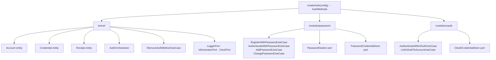

# @odysseon/whoami-core



## Delegated Responsibility

This package enforces authentication rules and exposes the contracts that adapters must implement. It contains zero framework or I/O dependencies.

## Entry points

| Entry point                      | Consumer             | Contains                                                 |
| -------------------------------- | -------------------- | -------------------------------------------------------- |
| `@odysseon/whoami-core`          | Application code     | `createAuth`, all ports, entities, errors, value objects |
| `@odysseon/whoami-core/internal` | Adapter authors only | Concrete use-case classes for NestJS DI token wiring     |

## createAuth

`createAuth(config: AuthConfig): AuthMethods` is the primary API. It composes all use-cases internally — you never import use-case classes directly from this package.

```ts
import { createAuth } from "@odysseon/whoami-core";

const auth = createAuth({
  accountRepo,
  receiptSigner,
  receiptVerifier,
  logger: console,
  idGenerator: () => crypto.randomUUID(),

  // omit either section to disable that auth method
  password: { passwordStore, passwordHasher },
  oauth: { oauthStore },
});

const receipt = await auth.registerWithPassword({ email, password });
```

### AuthConfig fields

| Field                  | Type                | Required | Description                                 |
| ---------------------- | ------------------- | -------- | ------------------------------------------- |
| `accountRepo`          | `AccountRepository` | ✓        | Persist and retrieve accounts               |
| `receiptSigner`        | `ReceiptSigner`     | ✓        | Mint receipt JWTs                           |
| `receiptVerifier`      | `ReceiptVerifier`   | ✓        | Verify receipt JWTs                         |
| `logger`               | `LoggerPort`        | ✓        | Structured logger (`info`, `warn`, `error`) |
| `idGenerator`          | `IdGeneratorPort`   | ✓        | `() => string` — e.g. `crypto.randomUUID`   |
| `clock`                | `ClockPort`         | –        | Override `Date.now()` for testing           |
| `tokenLifespanMinutes` | `number`            | –        | Receipt TTL, default 60                     |
| `password`             | `PasswordConfig`    | –        | `{ passwordStore, passwordHasher }`         |
| `oauth`                | `OAuthConfig`       | –        | `{ oauthStore }`                            |

## Methods

### Always present

| Method                                          | Description                                                                              |
| ----------------------------------------------- | ---------------------------------------------------------------------------------------- |
| `getAccountAuthMethods(accountId)`              | Returns all active auth methods for the account                                          |
| `removeAuthMethod(accountId, method, options?)` | Removes an auth method; throws `CannotRemoveLastCredentialError` if it would be the last |

### Present when `password` is configured

| Method                            | Description                                            |
| --------------------------------- | ------------------------------------------------------ |
| `registerWithPassword(input)`     | Creates account + password credential, returns receipt |
| `authenticateWithPassword(input)` | Verifies password, returns receipt                     |
| `addPasswordToAccount(input)`     | Adds a password credential to an existing account      |
| `changePassword(input)`           | Verifies current password, stores new hash             |

### Present when `oauth` is configured

| Method                         | Description                                                 |
| ------------------------------ | ----------------------------------------------------------- |
| `authenticateWithOAuth(input)` | Three-phase OAuth flow, returns receipt                     |
| `linkOAuthToAccount(input)`    | Links an OAuth provider to an already-authenticated account |

> **Unlinking an OAuth provider**: use `auth.removeAuthMethod(accountId, "oauth", { provider })`.
> This routes through the kernel's last-credential guard and prevents accidental account lockout.

## Ports summary

| Port                      | Provided by                       | Purpose                                                   |
| ------------------------- | --------------------------------- | --------------------------------------------------------- |
| `AccountRepository`       | Your infra                        | Persist and retrieve accounts                             |
| `PasswordCredentialStore` | Your infra                        | Persist and retrieve password credentials                 |
| `OAuthCredentialStore`    | Your infra                        | Persist and retrieve OAuth credentials (one per provider) |
| `PasswordHasher`          | `@odysseon/whoami-adapter-argon2` | Hash and compare passwords                                |
| `ReceiptSigner`           | `@odysseon/whoami-adapter-jose`   | Sign receipt JWTs                                         |
| `ReceiptVerifier`         | `@odysseon/whoami-adapter-jose`   | Verify receipt JWTs                                       |
| `LoggerPort`              | Your infra                        | Structured logging (`info`, `warn`, `error`)              |
| `IdGeneratorPort`         | Your infra                        | `() => string` — any unique-ID strategy                   |
| `ClockPort`               | Optional / your infra             | Override clock for testing                                |

## PasswordCredentialStore contract

```ts
interface PasswordCredentialStore {
  findByAccountId(accountId: AccountId): Promise<Credential | null>;
  save(credential: Credential): Promise<void>;
  update(credentialId: CredentialId, newHash: string): Promise<void>;
  delete(credentialId: CredentialId): Promise<void>;
  existsForAccount(accountId: AccountId): Promise<boolean>;
}
```

## OAuthCredentialStore contract

```ts
interface OAuthCredentialStore {
  findByProvider(
    provider: string,
    providerId: string,
  ): Promise<Credential | null>;
  findAllByAccountId(accountId: AccountId): Promise<Credential[]>;
  save(credential: Credential): Promise<void>;
  delete(credentialId: CredentialId): Promise<void>;
  deleteByProvider(accountId: AccountId, provider: string): Promise<void>;
  deleteAllForAccount(accountId: AccountId): Promise<void>;
  existsForAccount(accountId: AccountId): Promise<boolean>;
}
```

## License

[ISC](LICENSE)
