# @odysseon/whoami-core

```mermaid
graph TD
    Password["PasswordModule(config) → PasswordMethods & AuthModule"]
    OAuth["OAuthModule(config) → OAuthMethods & AuthModule"]
    MagicLink["MagicLinkModule(config) → MagicLinkMethods & AuthModule"]

    Password --> PwdUseCases["RegisterWithPasswordUseCase\nAuthenticateWithPasswordUseCase\nAddPasswordUseCase\nChangePasswordUseCase\nRequestPasswordResetUseCase\nVerifyPasswordResetUseCase"]
    Password --> PasswordHasher["PasswordHasher port"]
    Password --> PasswordStore["PasswordCredentialStore port"]

    OAuth --> OAuthUseCases["AuthenticateWithOAuthUseCase\nLinkOAuthToAccountUseCase\nUnlinkOAuthProviderUseCase"]
    OAuth --> OAuthStore["OAuthCredentialStore port"]

    MagicLink --> MLUseCases["RequestMagicLinkUseCase\nAuthenticateWithMagicLinkUseCase"]
    MagicLink --> MLStore["MagicLinkCredentialStore port"]

    Kernel["kernel"] --> Account["Account entity"]
    Kernel --> Credential["Credential entity"]
    Kernel --> Receipt["Receipt entity"]
    Kernel --> Orchestrator["AuthOrchestrator"]
    Kernel --> SharedPorts["LoggerPort · IdGeneratorPort · ClockPort · SecureTokenPort"]
```



## Delegated Responsibility

This package enforces authentication rules and exposes the contracts that adapters must implement. It contains zero framework or I/O dependencies.

## Entry points

| Entry point                       | Consumer             | Contains                                                |
| --------------------------------- | -------------------- | ------------------------------------------------------- |
| `@odysseon/whoami-core`           | Application code     | All ports, entities, errors, value objects              |
| `@odysseon/whoami-core/password`  | Application code     | `PasswordModule`, `PasswordMethods`, password ports     |
| `@odysseon/whoami-core/oauth`     | Application code     | `OAuthModule`, `OAuthMethods`, OAuth ports              |
| `@odysseon/whoami-core/magiclink` | Application code     | `MagicLinkModule`, `MagicLinkMethods`, magic-link ports |
| `@odysseon/whoami-core/kernel`    | Application code     | `AuthOrchestrator`, entities, shared ports              |
| `@odysseon/whoami-core/internal`  | Adapter authors only | Concrete use-case classes for adapter DI token wiring   |

## Per-Module Typed Facades

**Composition happens at the application layer, not inside core.** Each module factory returns a fully-typed object. Cross-module policy (e.g., last-credential guard) lives in `AuthOrchestrator`, which consumers instantiate separately.

```ts
import { PasswordModule } from "@odysseon/whoami-core/password";
import { OAuthModule } from "@odysseon/whoami-core/oauth";
import { AuthOrchestrator } from "@odysseon/whoami-core/kernel";

const password = PasswordModule({
  accountRepo,
  passwordStore,
  passwordHasher,
  receiptSigner,
  idGenerator,
  logger,
  clock,
  secureToken,
});

const oauth = OAuthModule({
  accountRepo,
  oauthStore,
  receiptSigner,
  idGenerator,
  logger,
});

// Direct usage — fully typed, zero ambiguity
const result = await password.registerWithPassword({ email, password });
// result.account.id  → string ✅
// result.account.email → string ✅
// result.token       → compile error ✅ (registerWithPassword returns { account })

const authResult = await password.authenticateWithPassword({ email, password });
// authResult.receipt.token → string ✅

// Cross-module policy — explicit opt-in
const orchestrator = new AuthOrchestrator([password, oauth]);
await orchestrator.removeAuthMethod(accountId, "password"); // last-credential guard
```

### Why no `createAuth`?

The previous `createAuth({ modules: [...] })` factory collapsed all module types to `Record<string, unknown>`. Every method became `unknown`, forcing developers to use non-null assertions (`!`) and casting. The type system was **worse than useless** — it actively misled.

By returning concrete types from each module factory, we eliminate the type-system fiction entirely:

- **Authoritative:** `password.authenticateWithPassword` is exactly `PasswordMethods["authenticateWithPassword"]`, period.
- **Deterministic:** No inference, no widening, no casts, no generics.
- **Honest:** Runtime structure matches compile-time types exactly.
- **Tree-shakeable:** Import only the modules you use, types and runtime both.

### Module factories

#### `PasswordModule(config)`

Returns `PasswordMethods & AuthModule`:

| Method                            | Description                                            |
| --------------------------------- | ------------------------------------------------------ |
| `registerWithPassword(input)`     | Creates account + password credential, returns account |
| `authenticateWithPassword(input)` | Verifies password, returns receipt + account           |
| `addPasswordToAccount(input)`     | Adds a password credential to an existing account      |
| `changePassword(input)`           | Verifies current password, stores new hash             |
| `requestPasswordReset(input)`     | Generates a secure reset token (returned plaintext)    |
| `verifyPasswordReset(input)`      | Exchanges valid token for a short-lived receipt        |
| `revokeAllPasswordResets(input)`  | Invalidates all pending reset tokens for an account    |

#### `OAuthModule(config)`

Returns `OAuthMethods & AuthModule`:

| Method                                | Description                                                                                    |
| ------------------------------------- | ---------------------------------------------------------------------------------------------- |
| `authenticateWithOAuth(input)`        | Three-phase OAuth flow (fast-path / conflict-guard / auto-register), returns receipt + account |
| `linkOAuthToAccount(input)`           | Links an OAuth provider to an already-authenticated account                                    |
| `unlinkProvider(accountId, provider)` | Removes a specific OAuth provider from an account                                              |

#### `MagicLinkModule(config)`

Returns `MagicLinkMethods & AuthModule`:

| Method                             | Description                                            |
| ---------------------------------- | ------------------------------------------------------ |
| `requestMagicLink(input)`          | Generates a secure magic-link token, returns plaintext |
| `authenticateWithMagicLink(input)` | Verifies token, returns receipt + account info         |

#### `AuthOrchestrator(modules)`

Cross-module policy enforcement. Pass an array of `AuthModule` instances:

| Method                                          | Description                                                                              |
| ----------------------------------------------- | ---------------------------------------------------------------------------------------- |
| `getAccountAuthMethods(accountId)`              | Returns all active auth methods for the account                                          |
| `removeAuthMethod(accountId, method, options?)` | Removes an auth method; throws `CannotRemoveLastCredentialError` if it would be the last |
| `countTotalCredentials(accountId)`              | Counts credentials across all registered modules                                         |

> **Unlinking an OAuth provider**: use `orchestrator.removeAuthMethod(accountId, "oauth", { provider })`.
> This routes through the kernel's last-credential guard and prevents accidental account lockout.

## Ports summary

| Port                       | Provided by                          | Purpose                                                   |
| -------------------------- | ------------------------------------ | --------------------------------------------------------- |
| `AccountRepository`        | Your infra                           | Persist and retrieve accounts                             |
| `PasswordCredentialStore`  | Your infra                           | Persist and retrieve password credentials                 |
| `OAuthCredentialStore`     | Your infra                           | Persist and retrieve OAuth credentials (one per provider) |
| `MagicLinkCredentialStore` | Your infra                           | Persist and retrieve magic-link credentials               |
| `PasswordHasher`           | `@odysseon/whoami-adapter-argon2`    | Hash and compare passwords                                |
| `ReceiptSigner`            | `@odysseon/whoami-adapter-jose`      | Sign receipt JWTs                                         |
| `ReceiptVerifier`          | `@odysseon/whoami-adapter-jose`      | Verify receipt JWTs                                       |
| `LoggerPort`               | Your infra                           | Structured logging (`info`, `warn`, `error`)              |
| `IdGeneratorPort`          | Your infra                           | `() => string` — any unique-ID strategy                   |
| `ClockPort`                | Optional / your infra                | Override clock for testing                                |
| `SecureTokenPort`          | `@odysseon/whoami-adapter-webcrypto` | Generate tokens and SHA-256 hashes                        |

## PasswordCredentialStore contract

```ts
interface PasswordCredentialStore {
  findByAccountId(accountId: AccountId): Promise<Credential | null>;
  findById(credentialId: CredentialId): Promise<Credential | null>;
  findByTokenHash(tokenHash: string): Promise<Credential | null>;
  save(credential: Credential): Promise<void>;
  update(credentialId: CredentialId, proof: PasswordProof): Promise<void>;
  delete(credentialId: CredentialId): Promise<void>;
  existsForAccount(accountId: AccountId): Promise<boolean>;
  countForAccount(accountId: AccountId): Promise<number>;
  deleteAllResetCredentialsForAccount(accountId: AccountId): Promise<void>;
  deleteExpiredResetCredentials(before: Date): Promise<void>;
}
```

## OAuthCredentialStore contract

```ts
interface OAuthCredentialStore {
  findByProvider(
    provider: string,
    providerId: string,
  ): Promise<Credential | null>;
  findAllByAccountId(accountId: AccountId): Promise<Credential[]>;
  save(credential: Credential): Promise<void>;
  delete(credentialId: CredentialId): Promise<void>;
  deleteByProvider(accountId: AccountId, provider: string): Promise<void>;
  deleteAllForAccount(accountId: AccountId): Promise<void>;
  existsForAccount(accountId: AccountId): Promise<boolean>;
  countForAccount(accountId: AccountId): Promise<number>;
}
```

## License

[ISC](LICENSE)
