# @odysseon/whoami-core

```mermaid
graph TD
    Core["@odysseon/whoami-core"]
    Core --> Accounts["accounts feature"]
    Core --> Auth["authentication feature"]
    Core --> Receipts["receipts feature"]
    Core --> Shared["shared domain"]

    Accounts --> AccountEntity["Account entity"]
    Accounts --> AccountRepo["AccountRepository port"]
    Accounts --> RegisterUC["RegisterAccountUseCase"]

    Auth --> CredentialEntity["Credential entity"]
    Auth --> CredentialStore["CredentialStore port"]
    Auth --> PasswordManager["PasswordManager port"]
    Auth --> TokenHasher["TokenHasher port"]
    Auth --> VerifyPasswordUC["VerifyPasswordUseCase"]
    Auth --> VerifyMagicLinkUC["VerifyMagicLinkUseCase"]
    Auth --> VerifyOAuthUC["VerifyOAuthUseCase"]
    Auth --> AuthenticateOAuthUC["AuthenticateOAuthUseCase"]

    Receipts --> ReceiptEntity["Receipt entity"]
    Receipts --> ReceiptSigner["ReceiptSigner port"]
    Receipts --> ReceiptVerifier["ReceiptVerifier port"]
    Receipts --> IssueUC["IssueReceiptUseCase"]
    Receipts --> VerifyUC["VerifyReceiptUseCase"]

    Shared --> VOs["Value Objects (AccountId, EmailAddress, CredentialId)"]
    Shared --> Errors["Domain errors"]
    Shared --> LoggerPort["LoggerPort"]
```

## Delegated Responsibility

This package enforces authentication rules and exposes the contracts that adapters must implement. It contains zero framework or I/O dependencies.

## Features

### `accounts`

Manages the `Account` aggregate. `RegisterAccountUseCase` enforces email uniqueness before persisting a new account through the `AccountRepository` port.

### `authentication`

Manages `Credential` aggregates for all supported proof kinds: `password`, `magic_link`, and `oauth`. Each use case accepts injected ports (`CredentialStore`, `PasswordManager`, `TokenHasher`, `LoggerPort`) and returns an `AccountId` on success.

| Use case                   | Proof kind                       |
| -------------------------- | -------------------------------- |
| `VerifyPasswordUseCase`    | `password`                       |
| `VerifyMagicLinkUseCase`   | `magic_link`                     |
| `VerifyOAuthUseCase`       | `oauth` (verify only)            |
| `AuthenticateOAuthUseCase` | `oauth` (auto-register + verify) |

### `receipts`

Manages the `Receipt` aggregate. `IssueReceiptUseCase` signs a receipt for an authenticated `AccountId` through the `ReceiptSigner` port. `VerifyReceiptUseCase` verifies a signed token through the `ReceiptVerifier` port.

## Ports Summary

| Port                | Feature        | Purpose                                                                                      |
| ------------------- | -------------- | -------------------------------------------------------------------------------------------- |
| `AccountRepository` | accounts       | Persist and retrieve accounts                                                                |
| `CredentialStore`   | authentication | Persist and retrieve credentials. `deleteByEmail` must be atomic for single-use magic links. |
| `PasswordManager`   | authentication | Hash and verify passwords                                                                    |
| `TokenHasher`       | authentication | Deterministically hash opaque tokens (magic links, API keys)                                 |
| `ReceiptSigner`     | receipts       | Sign a receipt JWT                                                                           |
| `ReceiptVerifier`   | receipts       | Verify and decode a receipt JWT                                                              |
| `LoggerPort`        | shared         | Framework-agnostic structured logging                                                        |

## License

[ISC](LICENSE)
