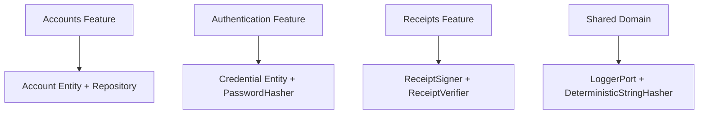

# @odysseon/whoami-core

## Delegated Responsibility

This package is responsible for enforcing authentication rules and exposing the contracts that adapters must implement.

## Purpose And Content

- The feature-first API exposes focused use cases, entities, and ports for `accounts`, `authentication`, and `receipts`.
- Shared modules define cross-feature value objects, errors, and infrastructure-facing ports without importing framework code.
- Error types keep the domain vocabulary explicit and framework-agnostic.

## Type Guarantees

- `HasId["id"]` supports both `string` and `number`.
- Repository and refresh-token contracts preserve `TEntity["id"]` instead of downgrading to `string`.
- The core leaves JWT serialization details to the token signer adapter, but the domain payload still models `sub` as `string | number`.

## Local Flow

- Validate configuration.
- Route the request to the credential or OAuth authenticator.
- Issue or refresh tokens through the token orchestrator.
- Delegate persistence and cryptography through injected ports.

## License

[ISC](LICENSE)
