# @odysseon/whoami-core

```mermaid
graph TD
    Factory["createAuth(config) → AuthMethods"]

    Factory --> Accounts["accounts feature"]
    Factory --> Auth["authentication feature"]
    Factory --> Credentials["credentials feature"]
    Factory --> Receipts["receipts feature"]
    Factory --> Shared["shared domain"]

    Accounts --> AccountEntity["Account entity"]
    Accounts --> AccountRepo["AccountRepository port"]
    Accounts --> RegisterAccountUC["RegisterAccountUseCase"]

    Auth --> AuthPwdUC["AuthenticateWithPasswordUseCase"]
    Auth --> AuthOAuthUC["AuthenticateOAuthUseCase"]
    Auth --> AddPwdUC["AddPasswordAuthUseCase"]

    Credentials --> CredentialEntity["Credential entity"]
    Credentials --> PwdStore["PasswordCredentialStore port"]
    Credentials --> OAuthStore["OAuthCredentialStore port"]
    Credentials --> PasswordMgr["PasswordManager port"]
    Credentials --> TokenHasher["TokenHasher port"]
    Credentials --> RegisterPwdUC["RegisterWithPasswordUseCase"]
    Credentials --> LinkOAuthUC["LinkOAuthToAccountUseCase"]
    Credentials --> RemovePwdUC["RemovePasswordUseCase"]

    Receipts --> ReceiptEntity["Receipt entity"]
    Receipts --> ReceiptSigner["ReceiptSigner port"]
    Receipts --> ReceiptVerifier["ReceiptVerifier port"]
    Receipts --> IssueUC["IssueReceiptUseCase"]
    Receipts --> VerifyUC["VerifyReceiptUseCase"]

    Shared --> VOs["Value Objects (AccountId, EmailAddress, CredentialId)"]
    Shared --> Errors["Domain errors (12 types)"]
    Shared --> LoggerPort["LoggerPort"]
```



## Delegated Responsibility

This package enforces authentication rules and exposes the contracts that adapters must implement. It contains zero framework or I/O dependencies.

## Entry points

| Entry point                      | Consumer             | Contains                                                 |
| -------------------------------- | -------------------- | -------------------------------------------------------- |
| `@odysseon/whoami-core`          | Application code     | `createAuth`, all ports, entities, errors, value objects |
| `@odysseon/whoami-core/internal` | Adapter authors only | Concrete use-case classes for NestJS DI token wiring     |

## createAuth

`createAuth(config: AuthConfig): AuthMethods` is the primary API. It composes all use-cases internally — you never import use-case classes directly from this package.

```ts
import { createAuth } from "@odysseon/whoami-core";
import {
  IssueReceiptUseCase,
  VerifyReceiptUseCase,
} from "@odysseon/whoami-core/internal";

const auth = createAuth({
  accountRepo,
  tokenSigner: new IssueReceiptUseCase({ signer, tokenLifespanMinutes: 60 }),
  verifyReceipt: new VerifyReceiptUseCase(verifier),
  logger: console,
  generateId: () => crypto.randomUUID(),
  password: { hashManager, passwordStore }, // omit to disable password auth
  oauth: { oauthStore }, // omit to disable OAuth auth
});

const receipt = await auth.registerWithPassword!({ email, password });
```

## Features

### `accounts`

Manages the `Account` aggregate. `RegisterAccountUseCase` enforces email uniqueness before persisting a new account through the `AccountRepository` port.

### `authentication`

Orchestrates authentication flows. Use cases are composed internally by `createAuth`; you interact with them through the `AuthMethods` facade.

| Use case                          | What it does                                                                      |
| --------------------------------- | --------------------------------------------------------------------------------- |
| `AuthenticateWithPasswordUseCase` | Looks up password credential by email, compares hash, issues receipt              |
| `AuthenticateOAuthUseCase`        | Three-phase OAuth flow: fast-path → conflict-guard → auto-register                |
| `AddPasswordAuthUseCase`          | Adds a password credential to an existing account (e.g. after OAuth registration) |

### `credentials`

Manages `Credential` aggregates. Two proof kinds are supported: `password` and `oauth`.

| Use case                      | What it does                                                      |
| ----------------------------- | ----------------------------------------------------------------- |
| `RegisterWithPasswordUseCase` | Creates account + password credential atomically, returns receipt |
| `LinkOAuthToAccountUseCase`   | Links an OAuth credential to an already-authenticated account     |
| `RemovePasswordUseCase`       | Removes a password credential by credential ID                    |
| `UpdatePasswordUseCase`       | Verifies current password and updates to a new hash               |

### `receipts`

Manages the `Receipt` aggregate. `IssueReceiptUseCase` signs a receipt for an authenticated `AccountId` via the `ReceiptSigner` port. `VerifyReceiptUseCase` verifies a signed token via the `ReceiptVerifier` port.

## Ports summary

| Port                      | Feature     | Purpose                                                   |
| ------------------------- | ----------- | --------------------------------------------------------- |
| `AccountRepository`       | accounts    | Persist and retrieve accounts                             |
| `PasswordCredentialStore` | credentials | Persist and retrieve password credentials                 |
| `OAuthCredentialStore`    | credentials | Persist and retrieve OAuth credentials (one per provider) |
| `PasswordManager`         | credentials | Hash and verify passwords (slow, salted — use argon2)     |
| `TokenHasher`             | credentials | Deterministically hash opaque tokens (fast, SHA-256)      |
| `ReceiptSigner`           | receipts    | Sign a receipt JWT                                        |
| `ReceiptVerifier`         | receipts    | Verify and decode a receipt JWT                           |
| `LoggerPort`              | shared      | Framework-agnostic structured logging                     |

## License

[ISC](LICENSE)
