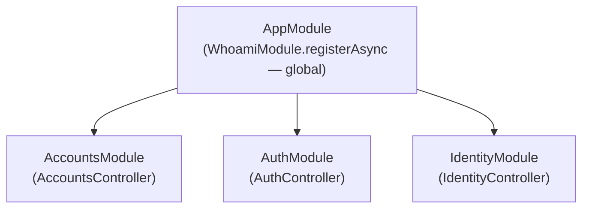

# @odysseon/whoami-example-nestjs

A NestJS 11 application demonstrating all `@odysseon/whoami-*` adapters wired through the NestJS DI container via `WhoamiModule`.

## Adapters used

| Adapter                              | Role                                                                                          |
| ------------------------------------ | --------------------------------------------------------------------------------------------- |
| `@odysseon/whoami-adapter-argon2`    | Hashes and verifies passwords                                                                 |
| `@odysseon/whoami-adapter-jose`      | Signs and verifies receipt JWTs                                                               |
| `@odysseon/whoami-adapter-webcrypto` | Available in stores for opaque token hashing                                                  |
| `@odysseon/whoami-adapter-nestjs`    | `WhoamiModule`, `WhoamiAuthGuard`, `WhoamiExceptionFilter`, `@CurrentIdentity()`, `@Public()` |

## Module structure



`WhoamiModule` is `@Global()` — registered once in `AppModule`. All three feature modules consume the `AUTH_METHODS` token and `WhoamiAuthGuard` without re-importing the module.

`WhoamiAuthGuard` is registered via `APP_GUARD`, making every route protected by default. Routes decorated with `@Public()` bypass verification.

## Run

```bash
# development (tsx, no compile step)
pnpm --filter @odysseon/whoami-example-nestjs dev

# production (compiled)
pnpm --filter @odysseon/whoami-example-nestjs build
pnpm --filter @odysseon/whoami-example-nestjs start
```

Set `PORT` to override the default (`3000`). Set `JOSE_SECRET` to a string of at least 32 characters to use a custom signing secret.

## Routes

| Method | Path                 | Auth         | Description                                             |
| ------ | -------------------- | ------------ | ------------------------------------------------------- |
| `POST` | `/accounts/register` | Public       | Create an account + password credential, return receipt |
| `POST` | `/auth/login`        | Public       | Verify password, return receipt token                   |
| `POST` | `/auth/oauth`        | Public       | Auto-register or verify via OAuth, return receipt token |
| `GET`  | `/me`                | Bearer token | Return authenticated account identity                   |

## cURL Examples

**Register:**

```bash
curl -X POST http://localhost:3000/accounts/register \
  -H "Content-Type: application/json" \
  -d '{"email":"ada@example.com","password":"secret123"}'
```

**Login:**

```bash
curl -X POST http://localhost:3000/auth/login \
  -H "Content-Type: application/json" \
  -d '{"email":"ada@example.com","password":"secret123"}'
```

**OAuth login** (auto-registers on first call):

```bash
curl -X POST http://localhost:3000/auth/oauth \
  -H "Content-Type: application/json" \
  -d '{"email":"ada@example.com","provider":"google","providerId":"g-12345"}'
```

**Protected profile** (use the `token` from any login response):

```bash
curl http://localhost:3000/me \
  -H "Authorization: Bearer <token>"
```
